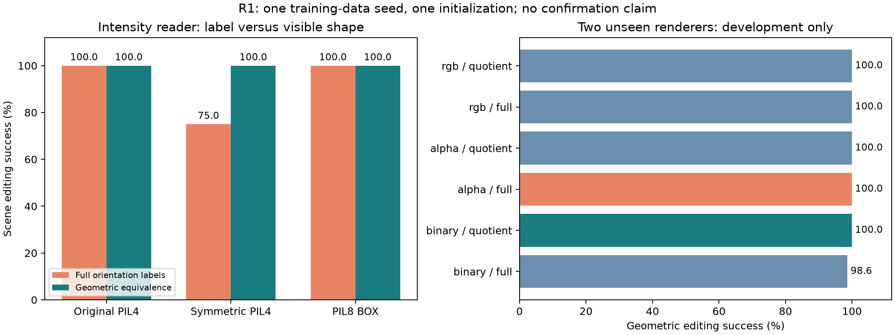

# OrbitLab

Small, auditable experiments on **rotation-aware representations, object editing,
conditional generation, and physical prediction**.

OrbitLab asks whether building rotation rules into a model helps it reconstruct,
generate, edit, and predict images. Synthetic scenes make the assumptions and
failure cases inspectable. This is an ongoing research project, not a
general-purpose vision model or a reproduction of every method discussed here.

**Public snapshot: 2026-09-29. The follow-up research is incomplete.**

## Read the evidence

| Study | Status in this snapshot | Evidence |
| --- | --- | --- |
| Original 15-session study | Historical completed study | [English results](../translations/en/RESULTS_EN.md), [Korean results](../RESULTS_KO.md) |
| Completion v2 | Bounded study completed; limitations retained | [English report](../completion_v2/TECHNICAL_REPORT_EN.md), [Korean report](../completion_v2/RESULTS_KO.md), [scope audit](../completion_v2/scope_audit.json) |
| R1: rendering and pose identifiability | Development evaluation verified; expansion gate failed | [Report](../research_v3/r1/RESULTS_KO.md), [verification](../research_v3/r1/verification.json) |
| R3: interactions and collisions | Development evaluation verified; expansion gate failed | [Report](../research_v3/r3/RESULTS_KO.md), [verification](../research_v3/r3/verification.json) |
| R2: learned readers under occlusion | Training/evaluation in progress; no verified final result | [Training protocol](../research_v3/r2/training_protocol.json), [evaluation protocol](../research_v3/r2/evaluation_protocol.json) |
| R4 / R5 | Planned; not completed | [Research plan](../completion_v2/NEXT_RESEARCH_PLAN_KO.md), [scope ledger](../research_v3/SCOPE_KO.md) |

The R1 baseline already achieved 100% geometric-equivalence editing on the two
held-out renderers in this small development study. The candidate therefore
could not meet the required five-percentage-point improvement. Identical images
with different orientation labels exposed a separate identifiability problem.

In R3, contact handling plus a learned residual reduced four-object, 61-step
position error from 11.57 to 6.02 pixels, but the same coarse physics without
learning achieved 2.62 pixels. Non-target counterfactual response also worsened.
Both studies used one development data seed and one initialization. Their
predeclared three-by-three confirmation stages were not triggered.




## Run the included checks

Python 3.13 was used locally. Tested dependency versions are in
[`requirements.lock.txt`](../requirements.lock.txt); installation on other
platforms has not been independently verified.

```sh
git clone https://github.com/brianyu43/orbitlab.git
cd orbitlab
python3 -m venv .venv
source .venv/bin/activate
python -m pip install -r requirements.lock.txt
python -m unittest discover -s tests -p 'test_research.py' -v
PYTHONPATH=followup:work python -m unittest discover -s followup -p 'test_object_world.py' -v
PYTHONPATH=followup:work python -m unittest discover -s followup -p 'test_dynamics_world.py' -v
```

These CPU checks cover the included original split, C4 transformations, metrics,
object rendering/editing, and reference physics. They do not retrain models or
reproduce the later experimental scores.

## Distribution limits

Published: research code, protocols, reports, selected figures, aggregates,
verification receipts, and the small original synthetic dataset.
**Later datasets, checkpoints, raw predictions, and ZIP releases are local-only.**
A receipt records checks on the original artifacts; it does not make those
artifacts available in a fresh clone. Historical reproduction commands may need
the omitted files.

Read the [publication scope](../PUBLICATION.md) and
[third-party notices](../THIRD_PARTY_NOTICES.md). Historical documents remain
unchanged; their completion claims apply to their own study scopes. Independent
human validation and real-image generalization are not established for the new
follow-up studies.

OrbitLab is independent and is not affiliated with or endorsed by KAIST MLML.
References to Dreamweaver and other papers provide context, not a claim to match
their published training budgets or results.
