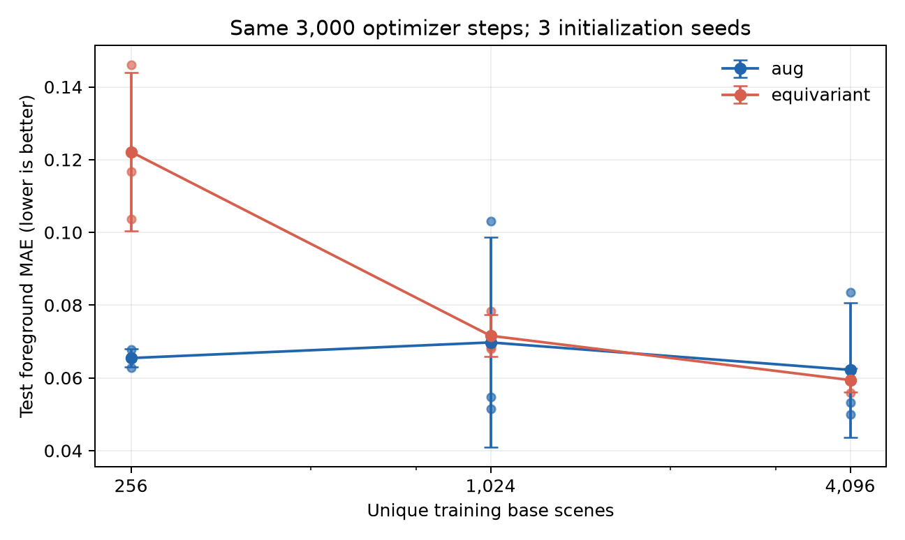
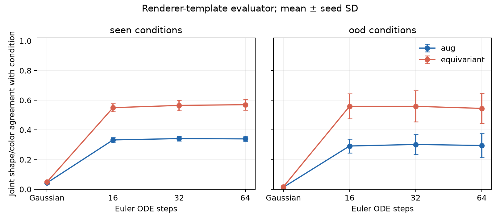

# OrbitLab 실험 결과 — 15회차 완료 보고

2026-09-23 · M5 Pro / 64GB · macOS 27 arm64 · Python 3.13.14 · PyTorch 2.14.0 / MPS FP32

**회전 일관성은 확인했지만 복원·생성의 모든 지표에서 C4 모델이 우세하지는 않았다.** 같은 시간의 AE 학습에서는 B1의 복원이 좋았고, 고정-step flow 생성에서는 B2의 조건 일치율이 높았다. 생성물의 흐림과 모양 오류는 여전히 크다. 15개 작업 슬롯의 요구 산출물을 실제로 수행했으며, 15일 또는 15×90분의 학습을 했다는 의미는 아니다.

## 1. 확보한 원본과 실제 수행 범위

iCloud Drive에 있던 `OrbitLab_starter.zip`과 `OrbitLab_Mac_실험계획서.docx`를 `sources/originals/`에 복사하고 SHA-256, ZIP CRC와 경로를 검사했다. ZIP의 11개 파일과 Word의 299개 문단을 확인했다. [원본 목록과 해시](reports/source_manifest.json), [원본 감사](reports/CODE_AUDIT_KO.md), [회수한 대화](sources/conversation_plan.md)를 보존했다.

원본 `orbitlab.py`, `probe_latents.py`, `extract_dino.py`는 변경하지 않았다. 추가 구현은 `research.py`, `probes.py`, `generation.py`에 있다. 실제 실행은 AE 비교 29회, 생성 진입을 위한 AE 보완 6회, flow 8회로 **43회**다. 별도로 원본 200-step pilot 1회와 1,000-step calibration 2회, doctor/smoke/단위검사, 저장 checkpoint의 CPU 재생 검사를 수행했다. DINO·동역학 확장은 이번 15회 범위에서 수행하지 않았다.

## 2. 설계, 데이터, 진입 기준

64×64 RGB 도형 4종과 색 6종을 썼다. data seed는 42로 고정했다. `(shape,color)=(0,0),(1,1),(2,2),(3,3)`은 학습에서 제외했다. train pool 4,096, validation/test/OOD 각 256개로, 4,864개 장면의 C4 orbit hash가 모두 다르다. train 후보 4개와 test 후보 1개의 중복을 제거했다. train 256/1,024/4,096은 고정 pool의 앞부분을 중첩해 사용한다. [데이터 명세](data/manifest.json)

초기화 seed 0/1/2, AE batch 32, AdamW lr 0.001, FP32, latent 총 64차원, 고정 마지막 checkpoint 규칙을 맞췄다. B1/B2의 외부 minibatch 원본과 회전 난수도 같다. B2는 내부에서 네 방향을 추가 평가한다. 주 실험 6회는 3,000 steps, 데이터 크기·파라미터·시간 통제는 별도의 탐색 비교다. 파라미터 통제 B2 width=31은 B1 대비 +1.15%이며 완전히 같은 파라미터 수는 아니다.

원본 200-step pilot의 전경 MAE는 0.2335로 흐렸다. validation-only calibration 뒤 주 비교를 3,000 steps로 고정했다. 생성 진입 기준은 validation MSE < black baseline의 0.5배, 전경 MAE≤0.10, IoU≥0.70, 복원 이미지의 shape/color 평가기 정확도 각각≥0.90 및 고정 grid의 모양 보존이다. 이 **복원 이미지 평가기 기준은 latent linear probe 90%와 다르다.** latent shape probe는 90%를 달성하지 못했다.

3,000-step B1 seed 2의 복원 색 정확도가 88.28%로 진입 기준을 실패했다. 기준을 낮추지 않고 양 모델×3 seed 모두 6,000-step으로 새로 학습해 여섯 모델 전부 통과했다. 이 보완 결정은 test/OOD 결과를 열기 전에 validation으로 했다. 보완 모델은 생성 전용이며 아래 3,000-step AE 표를 교체하지 않았다. [수치 gate](reports/quality_gate_repair.json), [실제 이미지 검토](reports/repair_visual_review.json)

## 3. AE 비교: 데이터 효율과 비용

각 칸은 3개 초기화 seed 평균 ± 표본 표준편차다. test/OOD는 각각 독립 장면 256개×4 회전이다. 원자료 CSV와 각 모델의 95% CI는 `runs/<id>/analysis/`에 있다. bootstrap은 네 회전을 먼저 평균한 원본 장면을 1,000회 재표집한다. 시드 표준편차와 장면 CI는 다른 불확실성을 측정한다.

| 비교 | 파라미터 | steps 평균 | 학습 초 | test 전경 MAE ↓ | test IoU ↑ | OOD 전경 MAE ↓ |
| --- | --- | --- | --- | --- | --- | --- |
| B1 회전 증강 | 315,075 | 3,000 | 13.83 ± 0.16 | 0.0697 ± 0.0289 | 0.8945 ± 0.0052 | 0.0707 ± 0.0260 |
| B2 C4 | 118,419 | 3,000 | 28.75 ± 0.04 | 0.0716 ± 0.0058 | 0.8298 ± 0.0158 | 0.0777 ± 0.0076 |
| B2 파라미터 통제 | 318,699 | 3,000 | 54.79 ± 0.01 | 0.0576 ± 0.0034 | 0.8781 ± 0.0030 | 0.0643 ± 0.0019 |
| B1 시간 통제 | 315,075 | 5,667 | 26.94 ± 0.00 | 0.0446 ± 0.0012 | 0.9378 ± 0.0032 | 0.0459 ± 0.0012 |
| B2 시간 통제 | 118,419 | 2,765 | 26.94 ± 0.00 | 0.0727 ± 0.0085 | 0.8170 ± 0.0051 | 0.0788 ± 0.0105 |

시간 통제의 실제 학습 시간은 양쪽 약 26.94초다. 이 예산에서 B1은 약 5,667 steps, B2는 약 2,765 steps를 수행했다. 전경 MAE는 0.04457 대 0.07268이다. 기본 B2는 파라미터가 적어도 이 구현에서는 더 느리다. 넓힌 B2의 전경 MAE는 개선됐으나 학습 시간이 54.79초로 늘었다. 하나의 공정성 표로 이 두 비교를 섞지 않는다.

| 장면 수 | B1 test 전경 MAE | B2 test 전경 MAE | B2−B1 paired 평균 |
| --- | --- | --- | --- |
| 256 | 0.0654 ± 0.0025 | 0.1221 ± 0.0217 | +0.05669 |
| 1024 | 0.0697 ± 0.0289 | 0.0716 ± 0.0058 | +0.00183 |
| 4096 | 0.0622 ± 0.0185 | 0.0594 ± 0.0033 | -0.00279 |

256개에서 B2가 모든 seed에서 더 나빴고, 1,024/4,096개에서는 seed별 우열이 바뀌었다. 따라서 **이 실험은 C4 구성의 보편적 데이터 효율 우위를 지지하지 않는다.** 같은 steps는 데이터 크기별 같은 epoch가 아니다. 단일 데이터 seed와 세 초기화로 모집단 유의성을 주장하지 않는다.

## 4. 표현과 개입: 정확한 대칭과 의미를 구분

본 C4 encoder의 test 회전 오차는 0, decoder 최대 오차는 약 1.19e-7이다. 이는 공유 encoder와 대칭화 decoder의 구조 검증이다. 이 설계가 논문의 모든 group-convolution layer를 재현한 것은 아니다. [C4 수식 및 한계](reports/C4_MATH_KO.md), [Cohen·Welling 원 논문](https://proceedings.mlr.press/v48/cohenc16.html)

probe는 **train 앞 256개 장면×4 회전**으로 표준화와 fitting을 하고 validation 256개로 C 또는 ridge alpha를 선택했다. AE 학습의 n=1,024와 probe fitting의 n=256을 혼동하면 안 된다. full/m0/m2/m13별 test/OOD·CI·rank를 [CSV](reports/representation_results.csv)에 저장했다. B2 full shape 정확도는 seed별 42.2/43.0/45.3%, color는 98.4/96.5/97.7%다. m0의 방향 probe는 세 seed 모두 25%다.

seed 0에서 m0만 남기면 전경 MAE는 전체 표현 0.07825에서 0.29146으로, 중심 오차는 0.00605에서 0.14627로 증가했다. 그림의 아래 행처럼 회전 대칭인 덩어리와 겹친 윤곽이 생겼다. B3 invariant-only도 test IoU=0.3435로 낮았다. 이는 위치·방향을 잃는 결과와 일치한다. 다만 band 제거는 학습 분포 밖의 latent를 만들므로 순수한 의미 분리의 인과 실험으로 해석하지 않는다. m1/m3에서 linear shape가 낮아도 비선형 정보가 없다는 증거는 아니다.

일반 AE에는 사람이 정한 slot shift를 정답 회전으로 간주하지 않고, train에서 학습한 A90으로 비교했다. 아래 closure는 표준화 좌표의 네 번 합성이다. full-matrix closure는 데이터가 차지하지 않는 방향에도 민감하다. B3의 in-data closure가 거의 0인데 행렬 closure는 0.866인 사례가 그 차이를 보여준다.

| 실행 | A90 상대 MSE | 데이터 내 A⁴ 상대 MSE | 행렬 A⁴−I 상대 Frobenius | 회전 정답 decode MSE |
| --- | --- | --- | --- | --- |
| primary_aug_n1024_s0 | 0.0339 | 0.0229 | 0.745 | 0.00175 |
| primary_equivariant_n1024_s0 | 2.41e-12 | 3.86e-11 | 0.000147 | 0.00257 |
| primary_aug_n1024_s1 | 0.0252 | 0.0159 | 0.873 | 0.00169 |
| primary_equivariant_n1024_s1 | 1.02e-12 | 1.63e-11 | 6.12e-05 | 0.00195 |
| primary_aug_n1024_s2 | 0.0204 | 0.0124 | 0.785 | 0.00270 |
| primary_equivariant_n1024_s2 | 7.74e-13 | 1.24e-11 | 4.15e-05 | 0.00206 |
| diagnostic_plain_n1024_s0 | 0.0752 | 0.0644 | 1.08 | 0.00614 |
| diagnostic_invariant_n1024_s0 | 2.23e-14 | 3.56e-13 | 0.866 | 0.02999 |

B2 A90 잔차가 작아도 회전 정답 decode MSE는 원래 복원 오차를 포함한다. B1의 큰 고정-rho 오차를 성능 열등의 근거로 사용하지 않았다.

## 5. 고정 AE에서 flow 생성

6,000-step AE의 encoder/decoder를 모두 고정하고 실제 weight 불변을 확인했다. 각 flow는 4,000 optimizer steps, batch 128이며 양쪽 파라미터 수가 같다. B2는 velocity 네 번 평가를 평균한다. slot별로 다른 표준화를 하지 않고 batch+group 공통 채널 평균·표준편차를 사용했다. Gaussian에서 latent로 가는 직선 경로의 벡터장을 학습하고 Euler ODE를 적분했다. 이 소형 실험은 [Flow Matching](https://arxiv.org/abs/2210.02747)의 원리를 사용하며 대형 RAE나 세계 모델의 재현은 아니다.

각 모델·seed마다 **동일한 576개 초기 noise**를 Gaussian/16/32/64 steps에 재사용했다. 24개 조건마다 24표본, 따라서 seen 480개·OOD 96개다. B1/B2 사이 noise SHA도 일치한다. 전체 8개 flow×4조건=18,432개 평가 행은 독립 noise 18,432개라는 뜻이 아니다. 같은 noise를 반복 평가한 것이다.

독립 renderer seed의 clean 512장면×4 회전에서 평가기는 shape/color 모두 100%, train orbit 중복 0이었다. 생성물은 흐리므로 이 정확도가 이전된다고 보장할 수 없다. `valid`는 silhouette template IoU≥0.65이면서 비어 있지 않다는 뜻이며, 인간이 보증한 생성 성공률이 아니다.

**64-step 결과, 3시드 평균±SD, 비율 0–1:**

| 모델 / 조건 | 모양 | 색 | 모양+색 | 형태 유효 | 유효 & 모양+색 | 중심 coverage |
| --- | --- | --- | --- | --- | --- | --- |
| B1 / seen | 0.351 ± 0.019 | 0.963 ± 0.032 | 0.340 ± 0.016 | 0.728 ± 0.016 | 0.247 ± 0.021 | 1.000 ± 0.000 |
| B1 / ood | 0.319 ± 0.074 | 0.920 ± 0.061 | 0.295 ± 0.081 | 0.681 ± 0.069 | 0.205 ± 0.049 | 0.625 ± 0.108 |
| B2 / seen | 0.577 ± 0.030 | 0.985 ± 0.011 | 0.570 ± 0.036 | 0.844 ± 0.012 | 0.522 ± 0.033 | 1.000 ± 0.000 |
| B2 / ood | 0.552 ± 0.089 | 0.976 ± 0.016 | 0.545 ± 0.100 | 0.837 ± 0.016 | 0.507 ± 0.074 | 0.958 ± 0.036 |

Gaussian에서 flow로 이동하면 조건 일치가 개선된다. B2의 seen 동시 일치율은 57.0%, B1은 34.0%다. 그러나 유효성과 조건 일치를 동시에 요구하면 각각 약 52.2%, 24.7%다. 따라서 **조건 제어의 상대적 개선은 관측했으나 고품질 생성 완성으로 판정하지 않는다.** OOD는 새로운 모양이나 새로운 색이 아니라 이미 본 factor의 네 미관측 조합이다. OOD와 seen의 조건 분포도 같지 않다.

| ODE steps | B1 seen | B2 seen | B1 OOD | B2 OOD |
| --- | --- | --- | --- | --- |
| Gaussian | 0.043 ± 0.010 | 0.049 ± 0.014 | 0.014 ± 0.006 | 0.017 ± 0.006 |
| 16 | 0.333 ± 0.015 | 0.550 ± 0.027 | 0.292 ± 0.048 | 0.559 ± 0.084 |
| 32 | 0.342 ± 0.016 | 0.565 ± 0.036 | 0.302 ± 0.068 | 0.559 ± 0.105 |
| 64 | 0.340 ± 0.016 | 0.570 ± 0.036 | 0.295 ± 0.081 | 0.545 ± 0.100 |

ODE steps 증가는 조건 정확도를 항상 높이지 않았다. 16→32, 32→64 latent 차이는 감소했지만 B1과 B2 latent의 척도가 다르므로 raw latent MSE를 모델 간 품질 비교에 쓰지 않았다. B2 세 seed의 coupled-noise ODE equivariance 오차는 0, decoder 교환 오차는 약 1.19e-7이었다. B1의 고정-rho GIF에는 구조적 회전 보장이 없다. B2 GIF를 회전 제어 증거로 제시한다.

시간 통제 flow는 seed 0의 탐색 비교다. 약 10.57초의 **flow 학습 부분**을 맞췄다. 앞선 AE 훈련 시간이나 ODE 추론 비용까지 맞춘 전체 파이프라인 비교가 아니다.

| 모델 | 실제 steps | 학습 초 | seen 동시 일치 | OOD 동시 일치 |
| --- | --- | --- | --- | --- |
| aug | 5125 | 10.568 | 0.338 | 0.354 |
| equivariant | 3808 | 10.570 | 0.562 | 0.490 |

## 6. 새 표본, 최근접 이웃, 실패 사례

64-step 고정 첫 48표본과 template 적합도 최저 16표본, 학습 최근접 거리 최소 8표본을 저장했다. B2에서는 작은 얼룩, 둥글어진 모서리, 잘못된 도형과 부정확한 색이 남았다. B1에서는 분리된 조각과 도형 합성이 더 자주 보였다. 이미지 검토 목록과 범위는 [시각 검토 기록](reports/result_visual_review.json)에 있다.

최근접 거리는 train 1,024장면의 네 회전 전체와 비교한 exact FP32 RGB MSE다. 독립 실제 test의 평균 거리는 0.00907, OOD는 0.01087다. 생성 seen의 평균은 B1 0.01140, B2 0.00896이다. 주 생성의 64-step 3,456개 이미지에서 1e-7 미만 복사는 관측되지 않았다. 이 픽셀 기준은 거의 복사한 이미지를 모두 배제하거나 분포 학습을 증명하지 못한다. 특히 흐림·배경은 거리를 낮출 수 있다.

seen의 유효·조건 일치 표본은 두 모델 모두 4×4 centroid 격자를 모두 채웠다. OOD coverage는 B1 평균 0.625, B2 0.958이었다. coverage는 조건 전체를 합친 위치 격자이며 전체 분포의 다양성 증명이 아니다. 기준 영역 밖 비율과 scale/centroid 표준편차도 `samples/metrics.json`에 보존했다. 생성 seen의 occupancy는 B1 0.0997, B2 0.1094로 실제 test의 0.0911보다 컸다. 관측 위치·크기 분포도 완전히 일치하지 않는다.

## 7. 자원·재현·한계

벤치마크는 warm-up 20 후 100-step을 세 번 측정하고 MPS를 동기화했다. 학습 시간에는 모델/data setup·최종 평가가 포함되지 않으며 그 구간의 속도를 전체 실행 시간으로 쓰지 않는다. 기록된 35개 본·보완 AE 중 최대 process RSS는 0.908 GiB다. 이는 MPS를 포함한 장치 전체 peak 메모리가 아니고, flow의 peak RSS는 별도로 측정하지 않았다. MPS driver allocation은 AE의 마지막 시점 값이다. 환경 fallback은 사용하지 않았다.

단일 데이터 생성 seed, 세 초기화 seed, 작은 합성 C4 세계라는 범위를 유지한다. 파라미터 통제는 근사 일치, 시간 통제는 이 Mac에서 측정한 값이다. 생성의 모양 평가기는 clean 데이터에서만 독립 검증됐다. probe는 256개 train 장면으로 제한했다. 사후에 테스트를 보고 기준을 낮추거나 좋은 seed만 교체하지 않았다. 3,000-step과 6,000-step AE 결과를 같은 학습 예산으로 합치지 않는다.

코드·설정·원본·checkpoint·CSV·환경 lock·해시를 보존했다. [재현 명령](REPRODUCE.md), [15회차 증거표](reports/SESSION_COMPLETION_KO.md), [완료 검사](reports/completion_checks.json), [6분 발표](deliverables/OrbitLab_6min.pptx)를 함께 확인할 수 있다. CPU 재생 검사는 저장 flow의 AE 절대경로를 별도 복사본에서 옮기고 같은 가중치로 표본을 생성하는 경로를 검사한다. 전체 43회 학습을 두 번째 Mac에서 다시 수행한 검증은 아니다.

## 8. 다음 실험의 결정

15회 범위의 판단은 H1 보편적 데이터 효율 우위 미지지, H2 불변 pooling의 위치·방향 손실 확인, H3 생성 조건 일치의 상대 개선과 불완전한 품질, H4 파라미터 수와 실제 비용의 차이 확인이다. 추가 실행을 하게 되면 먼저 **생성물에 대한 독립 사람 평가/평가기 견고성**, 이어서 data seed 반복과 전체 AE+flow 비용 통제를 고정하는 순서가 적절하다. 더 큰 모델이나 DINO·세계 모델을 붙이기 전에 현재 모양 오류를 측정 대상으로 삼는다. 이 후속 단계는 제안이며 이번 완료 실험 수에 포함하지 않았다.
