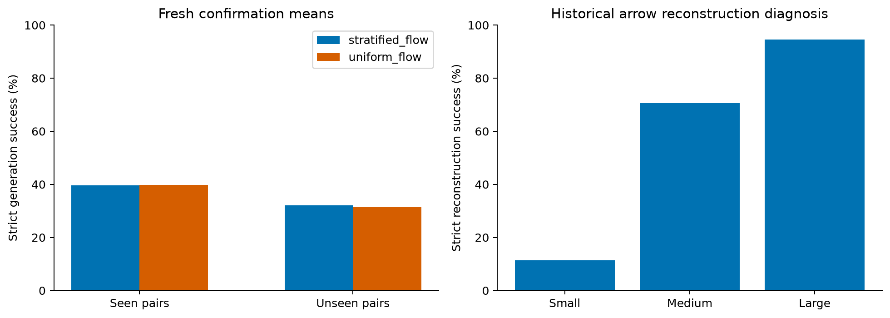
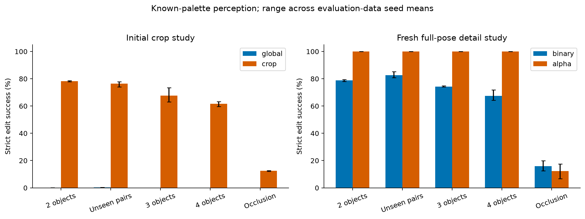
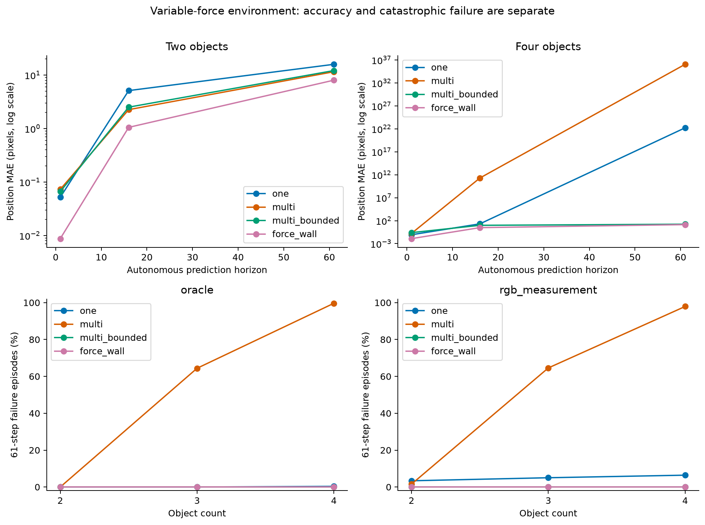
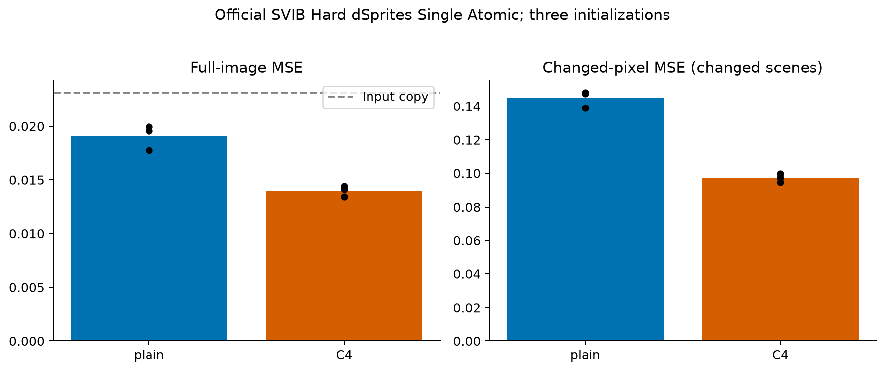

# OrbitLab 추가 실험 최종 결과

요청한 추가 실험과 재생 검증을 마쳤다. **영상에서 물체를 읽고 편집하는 성능은 크게 좋아졌지만, 가림·자유 생성·물체 수가 늘어난 장기 예측은 여전히 해결되지 않았다.** 아래에서 ‘실험 완료’와 ‘성능 목표 달성’을 구분한다. 다음 연구는 [별도 계획](NEXT_RESEARCH_PLAN_KO.md)에 구체적으로 정리했다. 이 결과들은 서로 다른 실험 계통의 결과이며 하나의 통합 모델 정확도가 아니다. 각 계통에 미리 주어진 정보는 [정보 예산 표](INFORMATION_BUDGET.md)에 명시했다.

## 쉽게 보는 핵심

그림을 작은 메모로 바꾸고 다시 그리는 과정에서, 작은 모양의 경계나 물체 위치가 사라질 수 있다. 이번에는 그 문제가 어느 단계에서 생기는지 나누어 확인했다. 회전 규칙을 넣는 것만으로 이 정보가 저절로 보존되지는 않는다.

- 생성: 이전 모델의 작은 화살표 복원 성공률은 11.43%, 큰 화살표는 94.51%였다. 같은 평가기에서 크기에 따른 차이가 컸다. 표본 비율과 decoder 손실을 바꿔 비교했지만 개발 단계 다양성 gate는 통과하지 못했다.
- 편집: 물체 주변을 잘라 읽는 새 파이프라인에서 크게 개선됐다. 단, 색상표를 알고 서로 다른 색의 물체를 구분할 수 있는 합성 환경이다. 가림이 없는 성공을 일반 사진 이해로 확대하지 않는다.
- 운동: 여러 단계를 함께 학습하면 두 물체의 예측 오차를 낮출 수 있다. 물체 수가 늘 때는 발산이 생길 수 있으며, 좌표 제한으로 숫자를 안정화하는 것과 충돌을 정확히 예측하는 것은 별개다.
- 외부 자료: 공식 SVIB 한 과제에서 C4 모델의 전체 이미지 MSE는 일반 모델보다 평균 26.8% 낮았다. 고정 5 epoch와 세 초기화의 결과이며, 정확한 모양 조작 성공률을 측정한 수치는 아니다.

## 1. 생성: 병목 진단과 새 확인 실험

과거 9개 모델 경로의 18,432개 회전 복원을 실제 renderer 크기별로 분해했다. 회전된 같은 장면을 독립 장면으로 세지 않았다. 작은 화살표의 test strict 복원은 11.43%, 중간 70.53%, 큰 모양 94.51%였다. 생성 표본에서 추정한 크기와 이 정답 크기 진단은 다르다.

여기서 엄격 성공은 요청한 모양·색을 맞히면서 기존 형태·품질 검사도 통과한 경우다. 색만 맞는 그림은 성공으로 세지 않는다.

개발에서 같은 AE 위에 균등/층화 flow와 기본/면적·경계 decoder를 2×2로 비교했다. 층화 flow+기본 decoder를 확인 후보로 고정했지만, 개발 다양성 gate 실패를 유지한 **진단 반복**이다. 새 데이터 3개×초기화 3개로 기준과 후보를 비교했다.

| 방식 | 본 조합: 엄격 성공 | 새 조합: 엄격 성공 | 본 조합: 모양 | 새 조합: 모양 | 본 조합: 색 | 새 조합: 색 |
| --- | --- | --- | --- | --- | --- | --- |
| 균형 flow + 기본 decoder | 39.67% | 32.16% | 72.60% | 68.62% | 99.49% | 99.33% |
| 균등 flow + 기본 decoder | 39.75% | 31.38% | 72.57% | 68.08% | 99.34% | 98.89% |

같은 자료·초기화끼리 짝맞춘 엄격 성공률 차이(후보−기준, %p)는 다음과 같다. 각 자료 안에서 초기화 3개를 먼저 평균했다.

| 자료 seed | 본 조합 변화(%p) | 새 조합 변화(%p) |
| --- | --- | --- |
| 880201 | -0.12 | -0.26 |
| 880202 | -0.08 | +1.11 |
| 880203 | -0.07 | +1.50 |

초기화 3개를 데이터 seed별로 모은 다양성 검사에서 전체 표본 gate는 5/6, strict 통과 표본 gate는 0/6였다. 이는 두 모델×세 데이터 seed의 검사 수다. 모으기 전 개별 확인 실행 18개에서는 전체 표본 14/18, strict 부분집합 0/18이 통과했다. 같은 noise를 공유하므로 초기화별 표본을 완전히 독립된 난수 표본으로 해석하지 않는다. 평균 성공률 향상만으로 다양성 목표 달성을 주장하지 않는다.

새 확인 모델의 두 decoder도 같은 정답 입력으로 복원시켜 크기별로 비교했다. 아래는 9개 경로·회전 복원을 합친 후속 진단이며, 후보 재선택에는 사용하지 않았다.

| 복원기 | 작은 화살표 | 중간 화살표 | 큰 화살표 | 새 조합 작은 화살표 |
| --- | --- | --- | --- | --- |
| standard | 14.43% | 74.40% | 91.30% | 13.93% |
| area_edge | 36.82% | 90.34% | 93.72% | 28.86% |

이 비교는 같은 AE에서 decoder 손실을 바꾼 효과를 보여준다. 생성 성공률은 flow가 만든 latent까지 거치므로 복원 성공률과 같지 않다. 36,864개 복원 행을 보존하고 18개 decoder 경로에서 각각 64장을 재생했다.

## 2. 인식과 편집: 공간 정보와 픽셀 세부 정보

| 실험 / 방식 | 물체 2개 | 새 모양·색 조합 | 물체 3개 | 물체 4개 | 가림 |
| --- | --- | --- | --- | --- | --- |
| 전체 그림 축소 | 0.07% | 0.26% | 0.00% | 0.00% | 0.00% |
| 물체 주변 자르기 | 78.21% | 76.48% | 67.62% | 61.72% | 12.57% |
| 후속: 이진 crop | 78.73% | 82.55% | 74.22% | 67.53% | 15.89% |
| 후속: 강도 보존 crop | 100.00% | 100.00% | 100.00% | 100.00% | 12.34% |

각 칸은 세 평가 데이터 seed와 세 초기화의 학습 controller 전체 편집 성공률 평균이다. 첫 연구와 후속 연구는 서로 다른 시험 자료를 썼다. 첫 연구의 global/crop은 공간 해상도, 정렬, 좌표 손실의 픽셀당 가중치를 함께 바꾼다. 좌표 정규화가 31.5 대 8이어서 crop의 픽셀 제곱 오차당 손실은 약 15.50배 크다. 따라서 crop만의 인과 효과라고 단정하지 않는다. 후속 binary/alpha는 같은 crop과 완전한 4방향 지도에서 픽셀 강도 보존 여부를 짝맞춘 비교다.

처음에는 지그재그가 180도 회전 후 같은 픽셀을 만든다고 잘못 가정하여 방향 손실을 두 종류로 묶었다. 추가 감사에서 실제 renderer의 경계 픽셀은 다름을 확인했다. 원본 결과는 그대로 보존했고, [정정 기록](PERCEPTION_AMENDMENT.md)과 새 데이터의 후속 실험을 추가했다. 기존 symmetry audit의 ‘unobservable’라는 표현은 철회했으며, 그 점수는 기하학적 동등성의 보조 점수로만 읽어야 한다.

alpha crop이 미세한 래스터 차이를 이용해 방향을 잘 읽더라도 이것만으로 의미 있는 방향 이해를 입증하지 못한다. 다음 실험은 렌더러를 바꾸어 이 의존성을 검사한다. 또한 결과 영상은 **알려진 renderer**로 그렸고, 물체별 명령 controller는 기존 모델을 사용했다. 새 CNN이 모든 물체 발견·조작·그리기를 처음부터 함께 학습한 결과는 아니다.

## 3. 장기 예측: 정확도와 발산을 따로 보기

한 단계와 여러 단계 모델은 optimizer update 수를 맞췄지만, 여러 단계 모델은 매 update에서 8단계를 계산하므로 계산량이 더 크다. 아래는 variable-force 환경의 정답 초기 상태 비교다. 영상에서 추정한 초기 상태, 나머지 환경, 행동 반응 및 기하학적 위반은 `aggregate.json`에 모두 보존했다.

| 모델 | 물체 2개: 16단계 오차(px) | 물체 2개: 61단계 오차(px) | 물체 4개: 61단계 오차(px) | 물체 4개: 61단계 발산율 |
| --- | --- | --- | --- | --- |
| one | 5.131 | 15.92 | 1.697e+22 | 0.35% |
| one_bounded | 4.796 | 15.59 | 17.53 | 0.00% |
| multi | 2.26 | 11.56 | 1.15e+36 | 99.65% |
| multi_projected | 2.717 | 13.8 | 17.41 | 0.00% |
| multi_bounded | 2.516 | 12.16 | 16.99 | 0.00% |
| force_wall | 1.055 | 8.039 | 13.79 | 0.00% |

`one`은 한 단계, `multi`는 8단계를 묶어 학습한 모델이다. `bounded`는 위치·속도 제한을 뜻한다. 표의 `1.15e+36` 같은 거대한 값은 예측이 사실상 완전히 발산한 경우다.

오차는 색상으로 대응시킨 물체의 장면별 끝점에서 x·y 각각의 절대 오차를 평균한 값이다. 비유한 값은 오차 평균에서 제외되므로 실패율과 반드시 함께 읽어야 한다. 실패율은 해당 horizon까지 비유한 값 또는 유한하지만 좌표 절댓값 64px 초과가 발생한 궤적 비율이다. 누락 물체 수 역시 별도 기록했다.

`multi_projected`는 multi 모델의 출력만 제한하고, `multi_bounded`는 그 제한을 포함해 학습한다. 제한 범위는 학습 자료의 속도와 알려진 벽 반경에서 정했다. 이 제한이 발산을 막아도 정확한 물리 법칙 학습의 증거는 아니다. `force_wall`은 외력·마찰·벽 반사 및 simulator의 시간 간격을 아는 특권적 비학습 참조이며 물체 간 충돌은 생략한다.

네 물체에서 61단계까지의 벽 관통과 물체 겹침도 점검했다. 아래 비율은 비유한 값이 없는 궤적에 대한 값이다.

| 모델 | 벽 관통 >1px (유한 궤적) | 물체 겹침 >1px (유한 궤적) |
| --- | --- | --- |
| one | 76.74% | 92.36% |
| multi | 100.00% | 98.38% |
| multi_bounded | 0.00% | 99.83% |
| force_wall | 0.00% | 99.48% |

정답 simulator의 39개 확인 자료 묶음에서는 동일한 1px 기준의 벽 관통·겹침 비율이 모두 0이었다. bounded 모델의 ‘발산 0%’는 충돌이 정확하다는 뜻이 아니다.

반대 행동을 넣었을 때의 변화량도 따로 평가했다. 아래는 두 물체·정답 초기 상태·variable-force의 16단계 결과다.

| 모델 | 16단계 대상 반응 오차 | 16단계 비대상 반응 오차 |
| --- | --- | --- |
| one | 7.814 | 2.275 |
| multi | 3.007 | 2.293 |
| multi_bounded | 3.463 | 2.325 |
| force_wall | 1.763 | 1.695 |

변화를 전혀 예측하지 않는 기준의 대상 오차는 13.12, 비대상 오차는 1.695px다. 대상의 직접 반응 개선과 다른 물체로 전달되는 간접 영향의 학습을 구분해야 한다. 좋은 위치 예측 점수가 곧 모든 개입 반응의 정확성을 뜻하지 않는다.

## 4. 공식 외부 자료: SVIB 한 과제 전체 split

Hard dSprites Single Atomic의 64,000개 학습쌍과 8,000개 시험쌍을 원래 128px로 사용했다. 모든 쌍에서 두 물체의 모양 교환과 나머지 속성 보존을 metadata로 확인했다. train/test의 정확히 같은 RGB 입력 중복은 0개였다. 시험의 12개 모양·크기·색 속성 조합은 학습에서 보지 않은 조합이다. 의미적/회전 궤도 전체 무중복을 증명한 검사는 아니다.

| 모델 | 전체 이미지 오차 | 바꿀 영역 오차 | 보존할 영역 오차 | 변경 없는 장면 오차 |
| --- | --- | --- | --- | --- |
| plain | 0.0191 | 0.1449 | 0.00429 | 0.008049 |
| c4 | 0.01398 | 0.09717 | 0.004291 | 0.009303 |

입력 복사 기준의 전체 MSE는 0.02313다. 시험 장면 중 6,007개는 실제 변경이 있고 1,993개는 모양이 같아 변경이 없다. 변경 없는 장면에서 모델이 오히려 이미지를 손상할 수 있으므로 그 오차도 공개했다. C4는 같은 파라미터 수와 optimizer update 수를 쓰지만 회전 네 개를 처리해 계산량이 더 크다. 시간은 동시 실행의 영향을 받는 실측값이다.

이 결과는 [공식 SVIB](https://systematic-visual-imagination.github.io/) 전체 12개 과제나 논문 baseline 학습 설정의 재현이 아니다. 한 과제의 전체 split을 사용한 작은 모델의 새 통제 실험이다. LPIPS와 독립 사람 평가는 이번에 추가하지 않았다.

## 5. 검증과 공개 범위

| 실험 | 평가 완료 수 | 검증 수 |
| --- | --- | --- |
| perception | 90 | 90 |
| perception_detail | 90 | 90 |
| dynamics | 1404 | 1404 |
| generation | 22 | 22 |
| svib | 6 | 6 |

동역학 개발 평가 18개는 위 1,404개 확인 평가와 별도다. 생성 22개에는 개발 4개가 포함된다. 평가 단위를 독립 연구 표본 수로 세지 않는다. 세 데이터 seed의 평균/범위와 초기화별 결과는 [원자료 집계](aggregate.json)에 있다. SVIB의 세 seed는 데이터 seed가 아니라 모델 초기화다.

생성 실험용 데이터 이미지 44,032개, 인식 source 3,840개와 target 17,685개, 동역학 초기 상태/이미지 6,720개의 회전 궤도 해시를 다시 계산했고, 지정한 서로 다른 장면 가족 및 과거 자료와의 중복은 0이었다. 한 source에서 나온 여러 편집은 같은 가족으로 묶었다.

체크포인트와 자료 해시, 원자료 점수 재계산, 고정 이미지/latent 재생, 전체 동역학과 반사실 궤적 재생을 검사했다. 검증의 정확한 표본 수는 각 `verification.json`에 있다. 별도 연구자의 완전 독립 구현 재현이나 전체 재학습을 수행했다는 뜻은 아니다. 기존 사람 응답 9개와 AI 판정 231개는 그대로이며 새 사람 검증은 없다.

기존 release의 1,324개 파일은 기준 해시와 일치했다. followup의 70,514개 파일 감사에서는 시작 전부터 있던 문서/상태 4개 차이를 별도로 보존하고 이번 실행에서 추가 변경이 생기지 않았는지 확인했다. 증거는 `original_integrity_final.json`에 있다.

## 6. 다음 연구로 넘길 것

[다음 연구 계획](NEXT_RESEARCH_PLAN_KO.md)은 렌더러 변경에 대한 방향 판별, 색상표 없는 가림 인식, 물체 수에 강한 접촉 모델, 작은 모양 복원, 여러 외부 과제 및 통합 모델 검증의 순서와 통과/중단 기준을 담고 있다. 성능 미달을 숨기지 않고, 무엇을 알고 입력했는지와 무엇을 실제로 배웠는지를 분리한 비교가 이 프로젝트의 다음 핵심이다.

재현과 재개: [REPRODUCE.md](REPRODUCE.md). 기술 세부: [TECHNICAL_REPORT_EN.md](TECHNICAL_REPORT_EN.md). 결과의 종료 기준과 제한: `scope_audit.json`.
