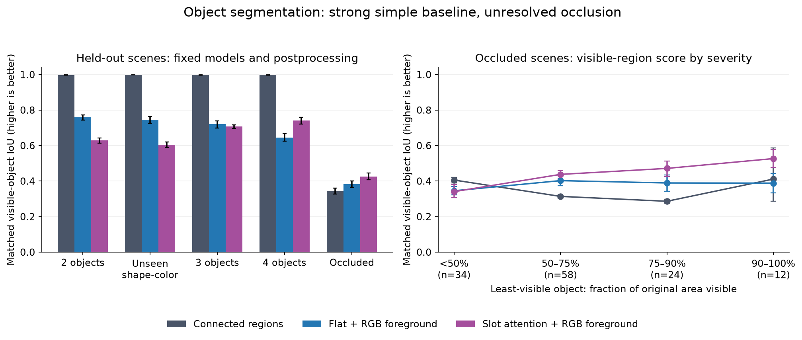

# 이미지에서 물체를 찾는 모델의 고정 평가

2026-09-23. B04의 현재 모델 구현·복원·물체 할당·가림 평가는 완료했다. **안정적인 물체 이해나 이미지 개입 능력을 달성했다는 뜻은 아니다.** 초기화 하나의 두 모델을 고정해 평가했으며, B05의 대상 변경·비대상 보존은 다음 단계다.

## 무엇을 구분했나

12,000-step flat/Slot Attention 모델을 고정했다. 입력은 RGB이며 정답 마스크·속성·실제 물체 수는 모델이나 후처리에 주지 않았다. 두 모델 모두 학습 slot이 5개로, 평가의 최대 네 물체와 배경을 표현할 용량은 있다. flat은 216,324개, Slot Attention은 148,100개 파라미터이므로 같은 파라미터 예산의 비교는 아니다.

동일한 validation에서 encoder attention, decoder mask, RGB 기여도로 만든 할당을 구분했다. 각 할당에 입력 RGB의 밝기가 0.05보다 큰 부분만 남기는 공통 후처리도 적용했다. 이 기준은 기존 학습 손실에서 사용한 값이며 정답에 맞춰 새로 조정하지 않았다. 원래 mask 결과를 보존하고 후처리를 별도 방법으로 보고한다.

validation에서 Slot Attention의 원래 decoder mask는 대응 영역의 약 91.7%가 실제 배경이었다. 입력 attention도 91.3%로 비슷했다. 전경을 남기면 영역 겹침은 decoder 0.090→0.621, attention 0.087→0.619로 개선됐다. 따라서 출력 decoder만 바꾸면 충분하다고 보기 어렵고, 배경 분리와 물체 사이 할당을 함께 점검해야 한다. [validation 원자료](../object_layers_validation_v1/summary.json)

## 보류했던 자료의 결과

아래는 실제 개별 물체의 **보이는 영역**과 가장 잘 대응시킨 mask의 IoU다. 1이 완벽하며, 명령 성공률이나 백분율 정확도가 아니다. 각 조건은 서로 다른 장면 128개다. 후처리 방식과 체크포인트는 이 결과를 보기 전에 고정했고 모든 변형을 보고했다.

| 평가 조건 | flat 원래 mask | Slot 원래 mask | flat + RGB 전경 | Slot + RGB 전경 | 연결 영역 기준선 |
| --- | ---: | ---: | ---: | ---: | ---: |
| 두 물체 test | 0.143 | 0.086 | 0.759 | 0.628 | 0.997 |
| 미관측 모양·색 조합 | 0.144 | 0.094 | 0.745 | 0.605 | 0.999 |
| 세 물체 | 0.137 | 0.103 | 0.720 | 0.707 | 0.998 |
| 네 물체 | 0.113 | 0.113 | 0.645 | 0.742 | 0.998 |
| 서로 가린 두 물체 | 0.082 | 0.071 | 0.384 | 0.427 | 0.342 |

RGB 전경 후처리에는 검은 배경이라는 과제의 특성이 도움이 된다. 복잡한 배경으로 일반화하는 학습된 배경 이해로 해석하지 않는다. 두 물체에서 좋은 쪽이 네 물체에서도 항상 좋은 것은 아니었다. 같은 초기 장면에 물체만 추가한 짝 실험은 아니므로 이 차이의 원인을 slot 경쟁 하나로 확정하지 않는다.

복원 이미지 전경 IoU는 test에서 flat 0.394/Slot 0.528, 네 물체에서 0.347/0.417, 가림에서 0.464/0.650이었다. 가림에서 그림 전체의 전경 복원이 좋아 보여도 개별 물체를 정확히 나누는 능력은 낮았다. [복원·실패 분석](../object_failure_audit_v1/summary.json)

## 오류의 종류

가림 조건에서 두 실제 물체에 같은 예측 영역이 주로 배정되는 **합침**은 연결 영역 기준선 97.7%, flat+전경 73.4%, Slot+전경 28.1%였다. 반대로 실제 물체의 보이는 픽셀 중 80%도 한 예측 영역에 모이지 않는 **조각남**은 물체별 평균으로 각각 3.5%, 41.0%, 70.7%였다. Slot 모델은 합치는 대신 여러 조각으로 나누는 오류가 많았다. 서로 다른 오류를 하나의 점수로만 판단하면 놓칠 수 있다.

가림 정도는 원래 물체 면적 중 얼마나 보이는지로 나눴다. 가장 덜 보이는 물체의 비율이 50% 미만/50~75%/75~90%/90~100%인 장면은 각각 34/58/24/12개다. 연결 영역 방법은 심하게 가려진 구간에서도 IoU가 상대적으로 높을 수 있다. 두 물체를 하나로 합친 예측이 면적이 큰 한 물체와 잘 겹치기 때문이며 가려진 물체를 복원했다는 뜻이 아니다. 이번 평가는 숨겨진 영역의 모양을 추론하는 능력을 측정하지 않았다.

오차 막대는 고정한 모델 아래에서 장면을 재표집한 95% 구간이다. 학습 초기화 간 불확실성은 포함하지 않는다. [확대 가능한 SVG](../object_failure_audit_v1/heldout_segmentation.svg)

## 검증과 다음 연결

validation과 보류 자료의 학습 모델 출력 1,536개, 물체 대응 6,912개를 재생·검산했다. 복원 1,280행과 보류 자료의 오류 분석 5,760행도 별도로 검사했다. 모든 조건에서 실제 각 물체에 보이는 픽셀이 있음을 확인했다. [고정 평가 검증](verification.json) · [오류 분석 검증](../object_failure_audit_v1/verification.json)

B05에서는 이 표현을 사용했을 때 목표의 속성을 바꾸면서 다른 물체를 보존할 수 있는지 평가한다. 목표 지정을 위해 실제 사용자가 줄 수 있는 점/표시와 모델이 알아내야 할 상태를 구분하고, 정답 물체 ID나 전체 정답 마스크를 이미지 모델 입력으로 넘기지 않는다. 기존 정답 상태 모델 B03은 별도의 상한 진단으로 유지한다. 이미지 기반 개입과 조작 합성의 오류 분석이 남아 있으므로 B05/B07의 완료로 세지 않는다.
