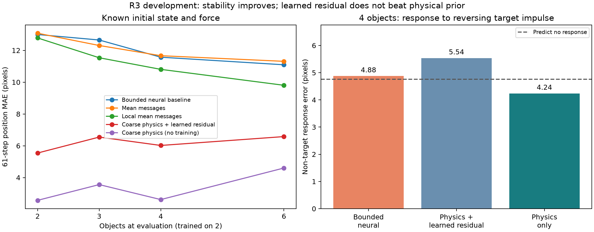

# R3 결과 — 안정성을 얻었지만 충돌을 잘 배운 것은 아니다

**물리적인 접촉 처리는 물체 겹침을 막았지만, 그 위에 학습한 보정이 단순 물리 계산보다 나빴다.** 따라서 확인 실험으로 확대하는 조건을 통과하지 못했다. 이번 단계는 실패 원인을 분리한 개발 실험으로 마무리한다.

## 실행한 비교

새 데이터 seed 888101의 두 물체 학습 궤적 384개, 모델별 2,000회 업데이트를 사용했다. 물체 2/3/4/6개를 각각 96개 궤적에서 1/16/61/128단계 예측했다. 매 평가군은 최초 예측 16단계의 무충돌/벽만 충돌/물체 충돌을 32개씩 포함한다.

첫 무작위 샘플링에서 여섯 물체의 무충돌군을 채우지 못해, 모델 학습 전에 대조군 생성 방식을 수정했다. 원래 데이터·소스·실패 기록은 `../r3_sampling_attempt_v1/`에 보존했다. 새 무충돌·벽 대조군은 속도·힘·행동이 작은 제어 조건이므로, 세 군의 평균을 자연 상황 전체의 성능으로 해석하지 않는다. [수정 사유](../R3_SAMPLING_AMENDMENT.md).

알려진 외력과 네 관측 프레임에서 추정한 외력을 분리했다. 두 경우 모두 초기 물체 상태는 정답을 주어 외력 추정의 영향만 나누었다. 영상 외력 추정기는 색상표·원형 모양·적분 규칙을 아는 비학습 참조다. 완전한 영상 기반 세계 모델이 아니다.

## 61단계 위치 오차

아래는 정답 초기 상태·외력을 제공한 개발 결과다. 단위는 픽셀이며 작을수록 좋다. 비유한 값 또는 좌표가 ±64px를 넘는 실패 경로는 평균에서 버리지 않고 128px 오차를 부여했다. 원래 유한 경로 오차와 실패 비율도 JSON에 함께 보존했다.

| 모델 | 2개 | 3개 | 4개 | 6개 | 4개 경로의 1px 초과 겹침 |
|---|---:|---:|---:|---:|---:|
| one | 12.79 | 12.83 | 12.51 | 16.52 | 96.9% |
| multi | 13.08 | 12.80 | 11.89 | 16.37 | 76.0% |
| multi_bounded | 13.00 | 12.65 | 11.57 | 11.09 | 57.3% |
| mean | 13.08 | 12.31 | 11.67 | 11.31 | 96.9% |
| local_mean | 12.78 | 11.54 | 10.81 | 9.80 | 6.2% |
| contact_residual | 5.55 | 6.55 | 6.02 | 6.58 | 0.0% |
| coarse_physics | 2.57 | 3.56 | 2.62 | 4.60 | 0.0% |
| force_wall | 5.75 | 5.69 | 5.96 | 6.65 | 64.6% |

네 물체에서는 제한을 둔 신경망 11.57px → 물리+학습 보정 6.02px로 개선됐다. 그러나 **학습하지 않은 동일한 거친 물리 계산은 2.62px**였다. 물리+학습 보정의 겹침 0%를 ‘충돌 법칙을 스스로 배웠다’고 해석할 수 없는 이유다.

두 물체로 학습할 때 이웃은 하나뿐이므로 합산과 평균 메시지 모델의 모든 학습 가중치는 비트 단위로 동일했다. `normalization_control_audit.json`이 이를 확인한다. 물체 수가 늘어난 뒤의 차이는 이 비교에서 이웃 메시지 정규화 효과로 분리할 수 있지만, 평균화만으로 접촉과 겹침 문제가 해결되지는 않았다.

## 왜 확대를 멈췄는가

- 물리+학습 보정은 위치·발산·벽·겹침 기준은 통과했다.
- 대상 물체의 힘을 반대로 바꿨을 때 **다른 물체의 반응 오차가 4.88→5.54px로 악화**되어, 악화 5% 이내 조건을 통과하지 못했다. 아무 반응도 예측하지 않는 참조의 오차는 4.76px였다.
- 두 물체끼리 충돌하는 군의 16단계 오차가 2.23px로, 개발 통과 기준 1px에 못 미쳤다. 같은 물리 계산만 쓴 참조는 약 0.99px였다.

따라서 3개 새 데이터×3개 초기화 확인은 실행하지 않았다. 이번 한 초기화의 짧은 개발 학습으로 모든 학습 보정이 나쁘다고 일반화하지 않는다. 다만 이 후보를 성공한 모델로 보고 반복 수만 늘릴 근거는 없었다.

다음 접촉 모델을 바꾼다면, 기준 물리 모델보다 나빠지지 않는 잔차 크기·접촉 순간별 손실·검증 선택을 별도 새 실험으로 사전 등록해야 한다. 현재 기준을 결과에 맞춰 낮추지는 않는다. 계획의 다음 실행 단계인 R2로 넘어간다.

## 검증

64/64 평가 조건에서 모든 128단계 예측, 대상 행동을 반전한 경로, 외력만 바꾼 경로를 재생했다. 총 18,432개 예측 경로와 24,576개 평가 행이다. 생성 시뮬레이터·반사실 정답·네 프레임 관측 및 외력 추정도 전체 재생했다. 기존 2–4물체 시뮬레이터와 131단계 일치, 여섯 물체의 회전 일관성, 고립 충돌의 운동량·에너지 보존을 별도 확인했다.

6개 모델의 학습 시간 합계는 125.0초다. 측정용 100-update 실행과 데이터 생성·평가 시간은 이 합계와 구별한다. 모든 계산은 로컬이며, 독립 연구자가 새 환경에서 재학습한 결과나 독립 사람 평가는 아니다.

자료: [사전 등록](protocol.json), [개발 판정](selection.json), [전체 수치](aggregate.json), [검증](verification.json), [시뮬레이터 검사](preflight.json), [실제 기간별 충돌 분류](actual_contact_strata.json).
