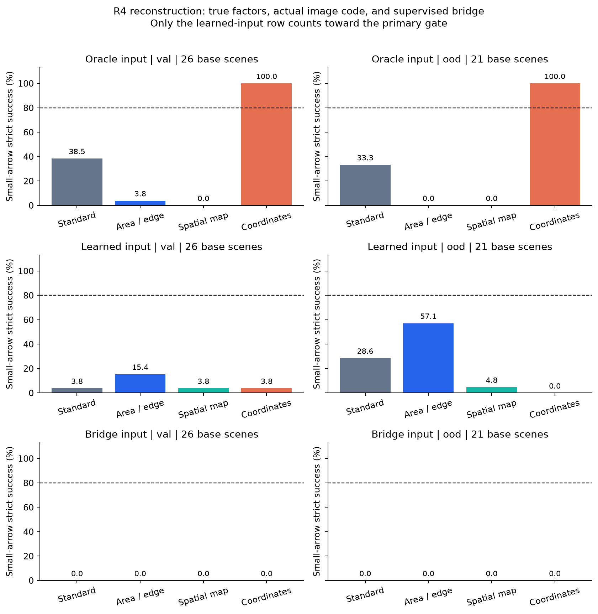
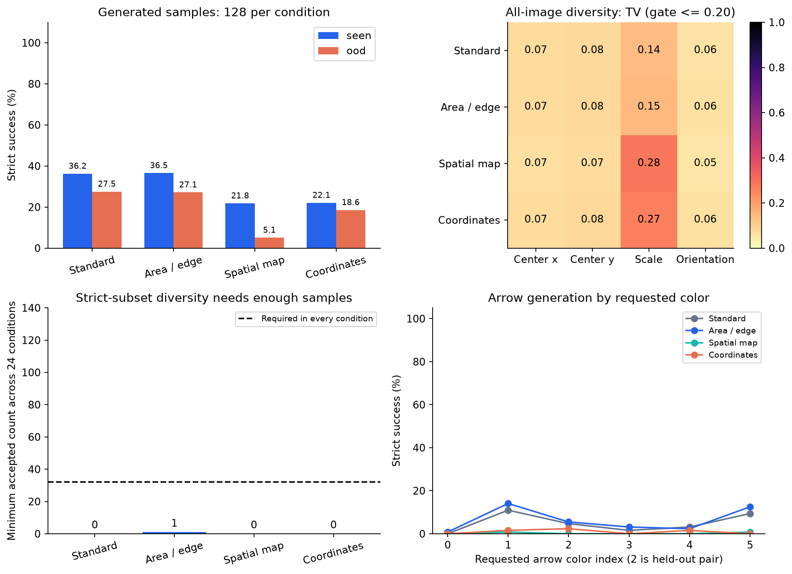
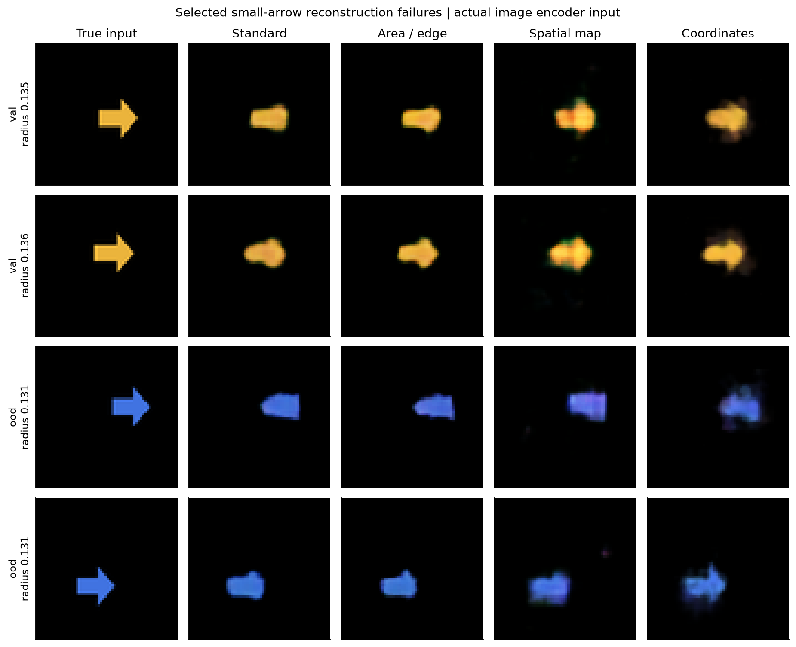

# R4: 작은 화살표 복원과 생성 다양성

네 방식의 개발 비교를 마쳤지만 모든 진행 기준을 통과한 개선 후보는 없다. 이 보고서는 개발 seed889101·초기화0의 결과다. 새로운 세 데이터×세 초기화 확인 결과와 구분한다. 테스트 split은 평가하지 않았다.

## 비교와 추가 정보

현재 방식과 area/edge 방식은 동일한 고정 인코더·디코더 구조·초기 가중치·학습 표본 순서·6,000업데이트를 사용하며 이미지 손실만 다르다. Spatial은 인코더와 디코더를 함께 바꾸고1×4×4배치를 유지하며 area/edge 손실을 쓴다. Coordinate는 기준 인코더를 공유하고 학습한 RGBA패치와 중심을 명시적으로 배치한다. 이 방식에는 정답 중심 감독이 추가된다. 따라서 네 방식 전체를 파라미터 수와 감독 정보가 같은 순수 구조 비교라고 해석하지 않는다.

정답 속성 역할은 실제 renderer의 모양·색·중심·반경·방향을 제공한다. 실제 이미지 역할과 **별도 가중치의 디코더**를 학습하므로 두 점수 차이를 고정된 디코더의 단순 인코더 교체로 해석하지 않는다. Bridge는 고정 인코더 코드에서 정답 속성 코드를 예측하도록 추가 감독한 작은 판독기로, 같은 oracle 디코더에 넣는 진단이다. 이 진단은 주 모델의 무감독 성능이나 후보 선정에 포함하지 않는다.

## 실제 작은 화살표의 복원

작음은 실제 renderer 반경0.13–0.24의 아래1/3이다. 각 원본 장면의 네 회전은 같은 표본이며 독립 장면 네 개로 세지 않는다. 값은 val/OOD이고, 엄격한 모양 기준과 요청된 모양·색을 모두 통과한 비율이다.

| 방식 | 정답 속성 | 실제 이미지 인코더 | 추가 감독 bridge |
|---|---:|---:|---:|
| Standard | 38.5%/33.3% | 3.8%/28.6% | 0.0%/0.0% |
| Area / edge | 3.8%/0.0% | 15.4%/57.1% | 0.0%/0.0% |
| Spatial map | 0.0%/0.0% | 3.8%/4.8% | 0.0%/0.0% |
| Coordinates | 100.0%/100.0% | 3.8%/0.0% | 0.0%/0.0% |

좌표 방식은 정답 속성을 받을 때 작은 화살표를 두 평가 구간 모두100%복원했지만, 실제 이미지 인코더에서는3.8%/0.0%였다. 따라서 그 디코더가 작은 화살표를 아예 그릴 수 없다는 설명은 맞지 않는다. 다만 입력 역할마다 디코더를 따로 학습했고 bridge도 별도 지도학습 모델이므로, 이 차이만으로 잠재 표현에 정보가 전혀 없다고 증명한 것은 아니다. 이번 표현·판독·학습 예산에서 그 정보를 유효하게 쓰지 못했다는 결과다.

작은 화살표의 독립 원본 장면 수는val26개/OOD21개다. 두 구간은 서로 다른 색상 조합과 장면 가족이므로 OOD수치가 더 높다는 사실을 분포 변화의 이득으로 해석하지 않는다. 네 회전을 새 독립 표본으로 늘려 세지도 않는다.

## 생성과 다양성

조건별128개, 총3,072개 표본을 같은 Gaussian noise로 짝맞췄다. 기존·area/edge·coordinate는 같은 flow와 인코더 코드를 공유하며, spatial만 별도 flow를 학습했다.64단계 Euler와 guidance1을 사용했다. 생성물의 중심·크기·방향은 고정 판독기의 추정치다.

| 방식 | Seen strict | OOD strict | 전체 다양성 통과 | Strict 부분집합 다양성 통과 |
|---|---:|---:|---|---|
| Standard | 36.2% | 27.5% | True | False |
| Area / edge | 36.5% | 27.1% | True | False |
| Spatial map | 21.8% | 5.1% | False | False |
| Coordinates | 22.1% | 18.6% | False | False |

참조는 조건별384개이며 모든9,216개 깨끗한 이미지의 strict 성공은100.0%다. 생성128개와 참조384개 히스토그램은 각각의 분모로 정규화한다. 기존 구간·coverage/TV/outside 기준과 조건별 최소32개 strict 표본 기준은 유지했다. 성공 표본만 골라 다양성이 좋아졌다고 보고하지 않는다.

기준/area-edge모델의 전체 표본 분포는 다양성 기준을 통과했지만 일부 모양·색 조건의 엄격한 성공 표본이0개/1개에 불과했다. 위치·크기가 다양하다는 것과 요청한 물체를 올바르게 다양하게 만든다는 것은 이 실험에서 일치하지 않았다.

## 사전 고정한 진행 기준

실제 이미지 인코더의 작은 화살표 복원이 val/OOD각80% 이상, seen/OOD동일 가중 평균 생성 strict가 기준보다10%p 이상 향상, 전체·strict부분집합 다양성 모두 통과해야 한다. 정답 속성이나 bridge 성능으로 이 조건을 대신하지 않는다.

| 후보 | 작은 화살표 낮은 쪽 | 생성 strict 변화 | 전체 gate |
|---|---:|---:|---|
| edge | 15.4% | -0.1%p | False |
| spatial | 3.8% | -18.5%p | False |
| coordinate | 0.0% | -11.6%p | False |

통과가 없으면3×3확인을 자동 확대하지 않는다. 실패를 포함한 결과이며 생성 문제 해결 또는 독립 사람 검증 완료를 뜻하지 않는다.

그림은 split별 기준 모델의 foreground오차가 큰 작은 화살표 두 장을 선택한 실패 예시다. 전체 성공률은 예시 선택과 무관하게 모든 장면에서 계산했다.

## 비용·검증·재현

14개 학습 구성 요소, 본 학습100,000업데이트,100회씩의 별도 예비 학습1,400업데이트를 실행했다. 본 학습 시간 합은3282.3초다. 이는 각 프로세스의 학습 구간 벽시계 시간 합이며 데이터 준비·평가·대기 시간이나 순수 CPU시간과 동일하지 않다. 검증과 학습이 일부 겹쳤다. 기준/공간 인코더 학습에 쓰인 decoder는 이후 분리 비교에서 교체되며, 그 선행 학습 비용도 아래 표에 포함했다.

| 구성 요소 | 파라미터 | 업데이트 | 학습 초 |
|---|---:|---:|---:|
| ae_base | 118,419 | 6,000 | 590.4 |
| ae_spatial | 68,068 | 6,000 | 669.4 |
| bridge_base | 2,128 | 4,000 | 1.0 |
| bridge_spatial | 2,128 | 4,000 | 1.0 |
| decoder_oracle_standard | 60,211 | 6,000 | 220.7 |
| decoder_oracle_edge | 60,211 | 6,000 | 240.7 |
| decoder_oracle_spatial | 42,131 | 6,000 | 284.6 |
| decoder_oracle_coordinate | 34,966 | 6,000 | 161.8 |
| decoder_learned_standard | 60,211 | 6,000 | 224.1 |
| decoder_learned_edge | 60,211 | 6,000 | 260.0 |
| decoder_learned_spatial | 42,131 | 6,000 | 371.4 |
| decoder_learned_coordinate | 34,966 | 6,000 | 197.3 |
| flow_base | 101,696 | 16,000 | 28.9 |
| flow_spatial | 101,696 | 16,000 | 31.1 |

24,576개 모델 복원 이미지와12,288개 생성 이미지, 모든 지표 행, 두 flow의6,144개 latent와각64적분 단계를 재생했다. 또한 clean입력2,048개, 참조9,216개와 모든 캐시 인코더 코드를 검증했다. 동일 구현을 재실행한 검증이며, 독립 구현·전체 재학습 또는 사람의 의미 품질 평가가 아니다.

캐시 생성 명령은 PyTorch 기본6스레드를 사용했고, 학습·주 평가는2스레드를 사용했다. 최초 검증도2스레드로 실행해 부동소수점 합산 순서에 따른 최대1.91×10⁻⁶ 차이에서 중단됐다. 캐시·모델·평가 기준은 보존하고 원래6스레드에서 허용오차0으로 재생한 뒤,2스레드 차이도 별도로 기록했다. 이는 성능 기준 완화가 아니라 실행 조건과 검증의 수정이다. 근거는pool_replay_protocol_v2.json과pool_verification_attempt_v1/AMENDMENT.json이다.

원본 파일은 읽기 전용으로 재사용하며 새로운 파일은research_v3아래에 있다. 실행 순서: r4_data.py및--verify → r4_preflight.py → r4_driver.py → r4_verify.py metrics → r4_evaluation_resume.py(캐시 검증은r4_pool_replay_v2.py) → r4_report.py. 모델/자료/평가 코드는 잠긴SHA256과 다르면 중단한다. 실제 논문 수준의 일반화는 이 단일 개발 실행만으로 주장하지 않는다.
