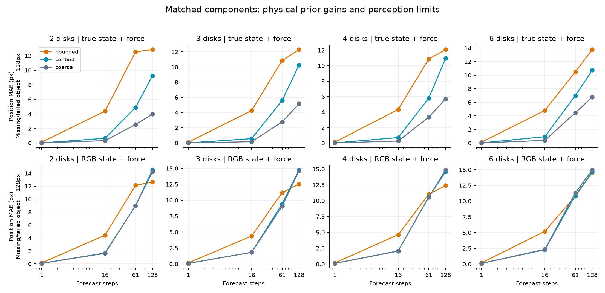
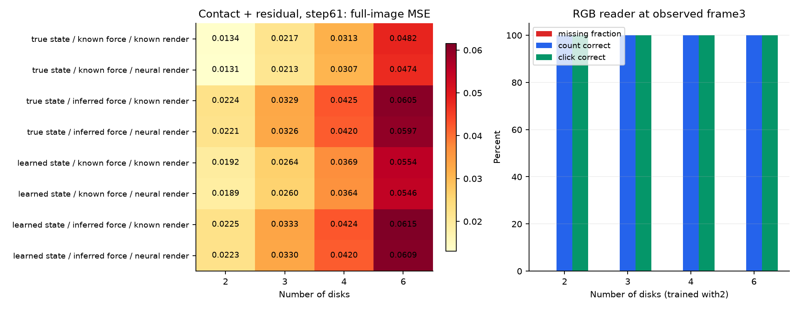
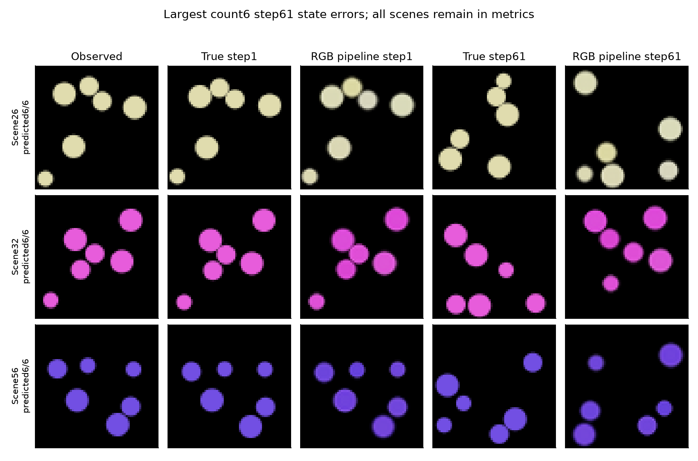

# R5 통합 진단: 같은 자료로 다시 학습한 인식·전이·그림 복원

**이 문서는 한 개발 데이터에서의 통합 실험 결과다. 외부 SVIB 실험, 새 데이터 반복 확인, 독립 사람 평가까지 모두 끝났다는 뜻은 아니다.**

이 제한된 원형 물체 자료에서 개수 정확도는 물체 수별 100.0–100.0%이고, 61단계 뒤 전체 RGB 경로의 상태+픽셀 성공은 0.0–0.0%였다. 개수 인식만으로 장기 예측을 판단할 수 없다. 아래의 구성 요소 교체로 누락, 움직임·외력 추정, 그림 복원과 장기 누적을 구분한다. 교체 결과의 해석이 유일한 원인을 증명하는 것은 아니다.

## 무엇을 연결했나

같은 960개 두 물체 학습 장면에서 인식기, 영상 외력 추정기, 신경 디코더, 두 전이 모델을 각각 새로 학습했다. 기존 R2의 다각형 인식기나 R3의 체크포인트를 그대로 연결하지 않았다. 입력은 과거부터 현재까지 RGB 4장이다. 검은 배경, 원형 물체, 같은 질량, 반지름 범위라는 도움을 받으며, 텍스처 배경·다각형 충돌을 해결한 실험이 아니다.

인식기는 최대 6개 물체의 위치·속도·반지름·RGB와 존재 확률을 예측한다. 학습 때 정답 상태와 중심 히트맵을 감독받는다. 시험 때는 정답 물체 수·색·위치·ID를 입력받지 않는다. 절반의 장면은 물체 색이 모두 같고 나머지는 연속 RGB다. 디코더는 상태에서 RGBA 조각을 만들고 좌표에 배치한다. 검은 배경과 좌표 배치가 알려진 구조이며, 원본 이미지를 그대로 통과시키는 연결은 없다.

bounded는 학습한 메시지 전달과 좌표·속도 제한을 사용한다. contact는 국소 평균 메시지와 별도의 거친 물리 충돌 계산에 학습 잔차를 더한다. 두 전이 모델의 학습 파라미터 수·초기 가중치·학습 표본 순서는 같지만, 물리 규칙과 계산량은 다르다. contact의 우세를 신경망이 충돌 법칙을 스스로 발견했다는 뜻으로 해석하지 않는다. 학습 잔차가 없는 coarse 물리 참조도 함께 비교했다.

## 데이터와 확인 범위

- 학습 960개, 별도 인식·외력 진단 96개, 시험 물체 수 2/3/4/6별 96개로 총 1,440개 새 장면이다. 개발 seed는 891101이다.
- 모든 저장 궤적·반사실 궤적·22,080개 저장 RGB를 다시 계산해 비트 단위 일치를 확인했다. 새 장면 간 및 로컬에 있는 기존 R3의 768개 장면과 초기 물리 회전 궤도 중복은 없었다. 모든 역사적 데이터와의 중복을 전수 확인했다는 뜻은 아니다.
- 충돌 없음/벽만 충돌/물체 간 충돌을 같은 비율로 맞췄다. 이를 위해 힘·속도·개입 크기가 서로 다른 제어된 표본을 사용했다. 자연 장면 빈도를 대표하는 평균은 아니다.
- 정답/추정 상태 × 정답/추정 외력 × 알려진/신경 렌더러의 교체 실험을 세 전이 방식에 적용했다. 모든 조건에서 원래 행동·반대 행동·외력 변경을 유지했다.
- 전체 13,824개 예측 궤적과 124,416개 출력 그림을 다시 계산해 일치를 확인했다. 이는 추론 재생이며 독립 재학습은 아니다.

## 학습 비용

| 구성 요소 | 파라미터 | 업데이트 | 학습 초 |
|---|---:|---:|---:|
| reader | 162,217 | 4,000 | 261.1 |
| force | 457,387 | 3,000 | 152.0 |
| decoder | 157,764 | 3,000 | 23.4 |
| bounded | 14,500 | 2,000 | 20.1 |
| contact | 14,500 | 2,000 | 43.6 |

총 14,000회 본 학습 업데이트와 별도 500회 시간 측정 파일럿을 실행했다. 파일럿 가중치는 버리고 초기화했다. 구성 요소 학습 시간 합은 500.1초이며 다른 작업과 겹친 로컬 측정이므로 독립 하드웨어 속도 비교나 전체 경과 시간과 같지 않다.

## 먼저 움직임 예측과 영상에서 읽는 문제를 구분하기

| 물체 수 | bounded 정답 상태·외력 | contact 정답 상태·외력 | coarse 정답 상태·외력 | contact RGB 상태·외력 |
|---|---:|---:|---:|---:|
| 2 | 12.545px | 4.885px | 2.536px | 8.987px |
| 3 | 10.851px | 5.594px | 2.768px | 9.403px |
| 4 | 10.850px | 5.795px | 3.334px | 10.604px |
| 6 | 10.480px | 6.976px | 4.444px | 10.893px |

61단계 위치 오차는 x/y 절대 오차 평균이다. 누락 물체와 실패 궤적에 128px 벌점을 넣었다. 큰 오차가 감지 실패인지 움직임 예측 실패인지 아래 인식 지표와 함께 봐야 한다. 초기 정답으로 맞춘 대응은 채점에만 사용하며, 추정 물체를 정답 ID 순서로 고쳐서 렌더링하지 않는다.



| 물체 수 | 개수 정확도 | 누락 비율 | 클릭 대상 정확도 | 인식 위치 오차(누락 포함) |
|---|---:|---:|---:|---:|
| 2 | 100.0% | 0.0% | 100.0% | 0.039px |
| 3 | 100.0% | 0.0% | 100.0% | 0.037px |
| 4 | 100.0% | 0.0% | 100.0% | 0.047px |
| 6 | 100.0% | 0.0% | 100.0% | 0.058px |

이 개수 정확도는 검은 배경과 서로 심하게 겹치지 않는 원형 물체에서 얻었다. 텍스처 배경·가림·다각형을 포함한 이전 R2의 누락 문제를 해결했다는 뜻은 아니다. 물체 개수를 맞히는 것과 정밀한 속도·힘을 알아내는 능력도 다르다.

힘 추정은 중력과 바람의 합 및 항력을 예측한다. 두 힘을 개별적으로 식별했다고 주장하지 않는다. 매우 약한 힘과 항력은 4장의 정수 픽셀 관측에서 구분하기 어려울 수 있다. 전체 결과 파일에는 같은 색/다른 색, 충돌 종류, 외력·행동 반사실, 물체별 누락을 함께 남겼다.

## 그림 복원과 오차 원인 교체



| 물체 수 | 입력 복사 MSE | 정답 미래→신경 디코더 MSE | contact 전체 RGB 경로 MSE | 전체 경로 상태+픽셀 성공 |
|---|---:|---:|---:|---:|
| 2 | 0.022507 | 0.000122 | 0.022275 | 0.00% |
| 3 | 0.030611 | 0.000184 | 0.032968 | 0.00% |
| 4 | 0.039734 | 0.000227 | 0.042001 | 0.00% |
| 6 | 0.053930 | 0.000351 | 0.060909 | 0.00% |

정답 미래 상태를 신경 디코더에 넣은 결과는 디코더 자체의 진단이다. 전체 경로와의 차이를 전부 하나의 구성 요소 때문이라고 단정할 수 없다. 교체 사이에는 서로 영향을 주는 오류가 존재한다. 픽셀 성공은 바뀐 영역 MAE≤0.05, 보존 영역 MAE≤0.01이며, 의미 상태 성공은 별도 위치·속도·반지름·색·개수·클릭 기준을 모두 요구한다. 배경이 큰 이미지에서 전체 MSE만 낮아진 것을 물체 이해 성공이라고 하지 않는다.



## 사전 기준과 남은 일

개발 통과 여부: **미통과 — 자동 확대 중단, 실패 진단 보존**.

| 사전 조건 | 충족 |
|---|---|
| `count4_position_20percent_better` | 예 |
| `count4_nontarget_response_not_worse_5percent` | 아니오 |
| `reader_count6_missing_atmost5percent` | 예 |
| `n2_failed_below1percent` | 예 |
| `n2_wall_below1percent` | 예 |
| `n2_overlap_below5percent` | 예 |
| `n3_failed_below1percent` | 예 |
| `n3_wall_below1percent` | 예 |
| `n3_overlap_below5percent` | 예 |
| `n4_failed_below1percent` | 예 |
| `n4_wall_below1percent` | 예 |
| `n4_overlap_below5percent` | 예 |
| `n6_failed_below1percent` | 예 |
| `n6_wall_below1percent` | 예 |
| `n6_overlap_below5percent` | 예 |
| `n2_stratum0_16step_atmost1px` | 예 |
| `n2_stratum1_16step_atmost1px` | 예 |
| `n2_stratum2_16step_atmost1px` | 아니오 |

충족하지 못한 조건은 2개다. 네 물체에서 비대상 물체의 행동 반응 오차는 bounded 5.228px, contact 5.744px이며 허용 악화는 5%다. 두 물체 간 충돌 장면의 contact 16단계 오차는 1.627px이고 기준은 1px다. 평균 위치 오차만이 아니라 이 조건들도 함께 판정했다.

이 통합 결과는 전체 R5 완료를 의미하지 않는다. SVIB 6개 외부 과제의 모든 학습·검증·속성 채점·조건부 반복은 별도 상태로 관리한다. 독립 사람 참가자는 없으며 기존 사람/AI 응답을 새 평가로 재사용하지 않았다. 다각형 충돌과 텍스처 배경은 이 원형 물체 진단을 넘어서는 후속 범위다.

## 재현 및 증거

프로젝트 루트에서 기존 의존성 환경을 사용한다. 전체 생성·학습은 저장된 동결 프로토콜과 소스 해시가 맞아야 하며, 원래 12시간/30GB 자원 상한을 유지한다. 완료된 파일이 있으면 검증 후 재사용하며 덮어쓰지 않는다.

```bash
.venv/bin/python research_v3/r5_disk_data.py prepare
.venv/bin/python research_v3/r5_disk_data.py verify
.venv/bin/python research_v3/r5_disk_preflight.py
.venv/bin/python research_v3/r5_disk_driver.py
# Then run each frozen evaluation cell and its --verify replay.
.venv/bin/python research_v3/r5_disk_evaluate.py verify_training
.venv/bin/python research_v3/r5_disk_report.py
```

새 출력 폴더에서 같은 seed의 독립 재학습을 실행하려면 `r5_disk_reproduce.py --name my_replication`으로 계획을 먼저 확인하고, `--execute`를 붙인다. 원본 프로토콜과 데이터를 덮어쓰지 않으며 새 시간·해시 기록을 만든다. 이 명령을 제공한 것 자체가 별도 재학습을 완료했다는 뜻은 아니다.

원본 명령과 셀 순서는 `r5_disk_evaluation_driver.py`, 기준은 `data_protocol.json`, `training_protocol.json`, `evaluation_protocol.json`에 있다. `verification.json`은 57개 단위 검증 및 전체 데이터·학습 검증의 해시를 연결한다. 새 환경에서의 독립 재학습은 별도 작업이며 이 보고서가 이를 대신하지 않는다.
