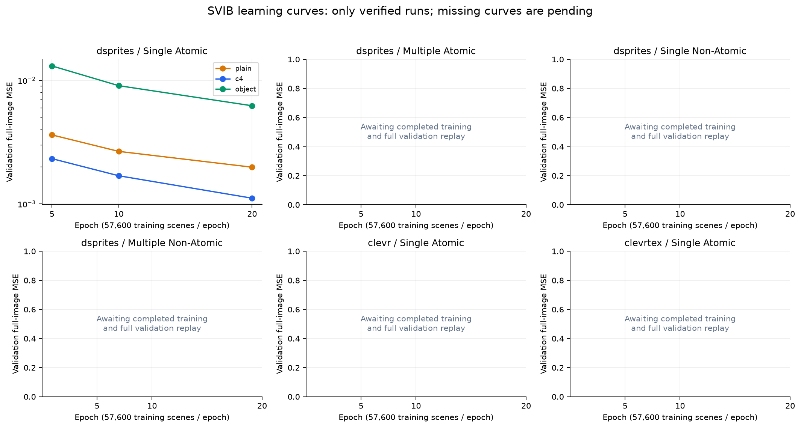
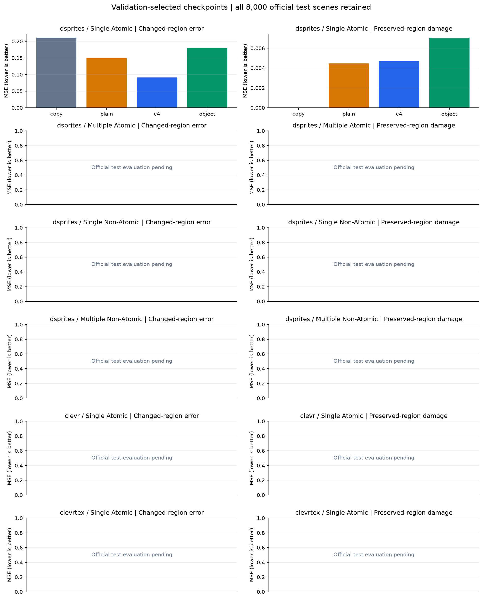
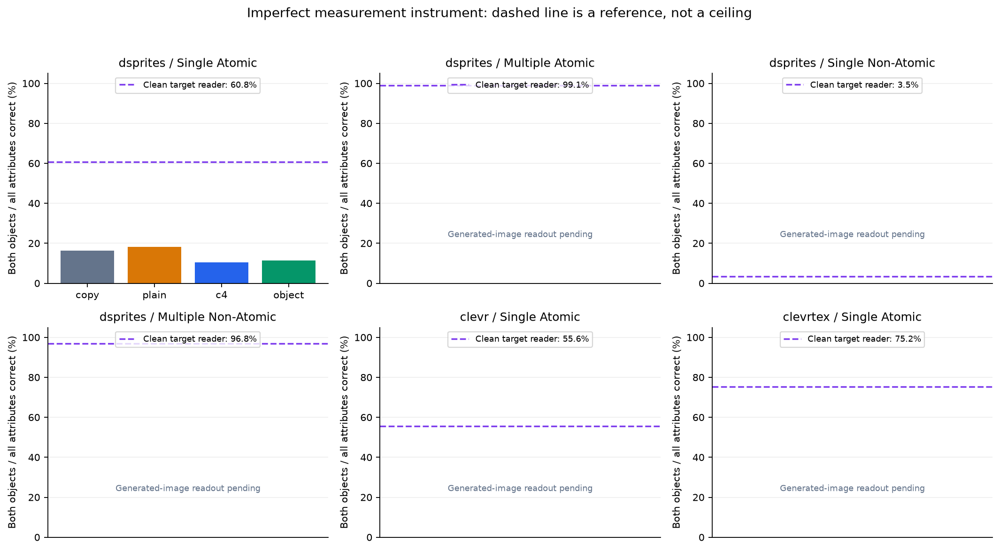
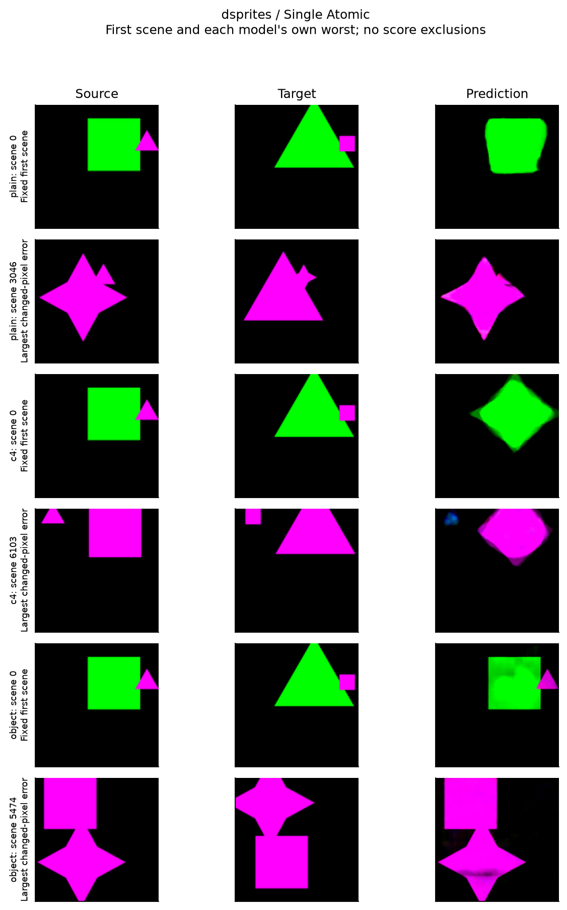

# R5 외부 과제: 학습량·규칙·시각 복잡도 비교

기준 시각: 2026-09-29T15:09:10.943072+00:00. **사용자 요청으로 실험을 중단했다. 필수 외부 과제와 확인 실험은 미완료로 남아 있다.**

개발 학습·전체 validation 재생 3/18, 공식 test 픽셀 재생 7/42, 속성 판독 재생 7/42이다. 선택 규칙으로 현재 요구되는 확인 학습은 0/18개 검증됐다. 아직 후보가 선택되지 않은 과제의 확인 필요 여부는 미정이다.

미완료 항목을 제외한 평균을 전체 성능으로 제시하지 않는다. 외부 실험 종료는 능력 향상·독립 사람 평가·프로젝트 전체 종료와 다르다.

## 실험과 정보 예산

- 공식 Hard dSprites의 네 과제, CLEVR Single Atomic, CLEVRTex Single Atomic을 각각 평가한다. 과제별 공식 학습 64,000개 중 57,600개로 학습하고 6,400개로 선택한다. 공식 test 8,000개는 고정한다.
- primary plain/C4/object 모델은 원본 RGB 한 장과 target RGB 학습 손실만 받는다. 정답 속성·위치·마스크는 받지 않는다. plain/C4는 1,266,467개 파라미터와 초기 가중치가 같고, object는 1,081,892개로 파라미터/계산량이 일치하지 않는다.
- 각 모델은 batch 32로 36,000회, 즉 20 epoch를 모두 학습한다. 5/10/20 epoch 중 validation 전체 MSE가 가장 작은 것을 선택한다. 별도로 고정 20 epoch 결과도 모두 남긴다.
- 후보는 validation 전체·변경 영역 MSE가 plain과 입력 복사보다 낮고, 보존 영역 손상이 plain 대비 5% 넘게 악화되지 않아야 한다. 통과 후보 중 전체 MSE가 가장 낮은 하나만 확인 실험으로 보낸다. 공식 test로 후보나 epoch를 선택하지 않는다.
- 확인은 같은 공식 학습 자료의 세 train/validation 재분할 × 세 초기화다. 서로 독립인 세 데이터셋 또는 새로운 공식 test가 아니다. 기존 dSprites Single Atomic test는 앞선 프로젝트에서도 사용했다.

## 학습 상태와 선택

| 과제 | 모델 | 전체 학습·검증 | 선택 epoch | 파라미터 | 학습 초 |
|---|---|---|---:|---:|---:|
| dsprites / Single Atomic | plain | 완료 | 20 | 1,266,467 | 1715.6 |
| dsprites / Single Atomic | c4 | 완료 | 20 | 1,266,467 | 2455.5 |
| dsprites / Single Atomic | object | 완료 | 20 | 1,081,892 | 2194.5 |
| dsprites / Multiple Atomic | plain | 9,000/36,000 업데이트; 검증 대기 | — | — | — |
| dsprites / Multiple Atomic | c4 | 9,000/36,000 업데이트; 검증 대기 | — | — | — |
| dsprites / Multiple Atomic | object | 대기 | — | — | — |
| dsprites / Single Non-Atomic | plain | 대기 | — | — | — |
| dsprites / Single Non-Atomic | c4 | 대기 | — | — | — |
| dsprites / Single Non-Atomic | object | 대기 | — | — | — |
| dsprites / Multiple Non-Atomic | plain | 대기 | — | — | — |
| dsprites / Multiple Non-Atomic | c4 | 대기 | — | — | — |
| dsprites / Multiple Non-Atomic | object | 대기 | — | — | — |
| clevr / Single Atomic | plain | 대기 | — | — | — |
| clevr / Single Atomic | c4 | 대기 | — | — | — |
| clevr / Single Atomic | object | 대기 | — | — | — |
| clevrtex / Single Atomic | plain | 대기 | — | — | — |
| clevrtex / Single Atomic | c4 | 대기 | — | — | — |
| clevrtex / Single Atomic | object | 대기 | — | — | — |

학습 초는 해당 실행이 측정한 값이며 검증 시간이 별도로 저장된다. 동시 실행·일시 정지의 영향이 들어가므로 서로 더한 값을 전체 경과 시간이나 독립 하드웨어 속도로 해석하지 않는다.



| 과제 | validation으로 선택한 확인 후보 |
|---|---|
| dsprites / Single Atomic | c4 |
| dsprites / Multiple Atomic | 선택 대기 |
| dsprites / Single Non-Atomic | 선택 대기 |
| dsprites / Multiple Non-Atomic | 선택 대기 |
| clevr / Single Atomic | 선택 대기 |
| clevrtex / Single Atomic | 선택 대기 |

## 공식 test: 모든 과제와 두 checkpoint 방식

픽셀은 0–1 RGB이다. 변경 영역은 source/target 픽셀이 실제로 다른 위치이며, 의미가 바뀐 물체와 동일한 정의가 아니다. 작은 영역의 개선이 전체 배경 평균에 가려지지 않도록 전체·변경·보존 MSE를 분리한다.

| 과제 | 방식 | 모델 | epoch | 전체 MSE | 변경 영역 MSE | 보존 영역 MSE | 두 물체 모든 속성 판독 |
|---|---|---|---:|---:|---:|---:|---:|
| dsprites / Single Atomic | validation_selected | copy | — | 0.023129 | 0.211372 | 0.000000 | 16.26% |
| dsprites / Single Atomic | validation_selected | plain | 20 | 0.019466 | 0.148899 | 0.004473 | 18.11% |
| dsprites / Single Atomic | fixed20epoch | plain | 20 | 0.019466 | 0.148899 | 0.004473 | 18.11% |
| dsprites / Single Atomic | validation_selected | c4 | 20 | 0.013824 | 0.090940 | 0.004679 | 10.55% |
| dsprites / Single Atomic | fixed20epoch | c4 | 20 | 0.013824 | 0.090940 | 0.004679 | 10.55% |
| dsprites / Single Atomic | validation_selected | object | 20 | 0.025600 | 0.179174 | 0.007075 | 11.40% |
| dsprites / Single Atomic | fixed20epoch | object | 20 | 0.025600 | 0.179174 | 0.007075 | 11.40% |
| dsprites / Multiple Atomic | validation_selected | copy | — | 대기 | 대기 | 대기 | 대기 |
| dsprites / Multiple Atomic | validation_selected | plain | — | 대기 | 대기 | 대기 | 대기 |
| dsprites / Multiple Atomic | fixed20epoch | plain | — | 대기 | 대기 | 대기 | 대기 |
| dsprites / Multiple Atomic | validation_selected | c4 | — | 대기 | 대기 | 대기 | 대기 |
| dsprites / Multiple Atomic | fixed20epoch | c4 | — | 대기 | 대기 | 대기 | 대기 |
| dsprites / Multiple Atomic | validation_selected | object | — | 대기 | 대기 | 대기 | 대기 |
| dsprites / Multiple Atomic | fixed20epoch | object | — | 대기 | 대기 | 대기 | 대기 |
| dsprites / Single Non-Atomic | validation_selected | copy | — | 대기 | 대기 | 대기 | 대기 |
| dsprites / Single Non-Atomic | validation_selected | plain | — | 대기 | 대기 | 대기 | 대기 |
| dsprites / Single Non-Atomic | fixed20epoch | plain | — | 대기 | 대기 | 대기 | 대기 |
| dsprites / Single Non-Atomic | validation_selected | c4 | — | 대기 | 대기 | 대기 | 대기 |
| dsprites / Single Non-Atomic | fixed20epoch | c4 | — | 대기 | 대기 | 대기 | 대기 |
| dsprites / Single Non-Atomic | validation_selected | object | — | 대기 | 대기 | 대기 | 대기 |
| dsprites / Single Non-Atomic | fixed20epoch | object | — | 대기 | 대기 | 대기 | 대기 |
| dsprites / Multiple Non-Atomic | validation_selected | copy | — | 대기 | 대기 | 대기 | 대기 |
| dsprites / Multiple Non-Atomic | validation_selected | plain | — | 대기 | 대기 | 대기 | 대기 |
| dsprites / Multiple Non-Atomic | fixed20epoch | plain | — | 대기 | 대기 | 대기 | 대기 |
| dsprites / Multiple Non-Atomic | validation_selected | c4 | — | 대기 | 대기 | 대기 | 대기 |
| dsprites / Multiple Non-Atomic | fixed20epoch | c4 | — | 대기 | 대기 | 대기 | 대기 |
| dsprites / Multiple Non-Atomic | validation_selected | object | — | 대기 | 대기 | 대기 | 대기 |
| dsprites / Multiple Non-Atomic | fixed20epoch | object | — | 대기 | 대기 | 대기 | 대기 |
| clevr / Single Atomic | validation_selected | copy | — | 대기 | 대기 | 대기 | 대기 |
| clevr / Single Atomic | validation_selected | plain | — | 대기 | 대기 | 대기 | 대기 |
| clevr / Single Atomic | fixed20epoch | plain | — | 대기 | 대기 | 대기 | 대기 |
| clevr / Single Atomic | validation_selected | c4 | — | 대기 | 대기 | 대기 | 대기 |
| clevr / Single Atomic | fixed20epoch | c4 | — | 대기 | 대기 | 대기 | 대기 |
| clevr / Single Atomic | validation_selected | object | — | 대기 | 대기 | 대기 | 대기 |
| clevr / Single Atomic | fixed20epoch | object | — | 대기 | 대기 | 대기 | 대기 |
| clevrtex / Single Atomic | validation_selected | copy | — | 대기 | 대기 | 대기 | 대기 |
| clevrtex / Single Atomic | validation_selected | plain | — | 대기 | 대기 | 대기 | 대기 |
| clevrtex / Single Atomic | fixed20epoch | plain | — | 대기 | 대기 | 대기 | 대기 |
| clevrtex / Single Atomic | validation_selected | c4 | — | 대기 | 대기 | 대기 | 대기 |
| clevrtex / Single Atomic | fixed20epoch | c4 | — | 대기 | 대기 | 대기 | 대기 |
| clevrtex / Single Atomic | validation_selected | object | — | 대기 | 대기 | 대기 | 대기 |
| clevrtex / Single Atomic | fixed20epoch | object | — | 대기 | 대기 | 대기 | 대기 |



## 자동 채점기를 함께 검증하기

속성 판독기는 primary 모델과 별도로 정답 속성 감독을 받아 학습했다. 평가 때 정답 source 중심의 112px crop을 사용하므로 위치를 스스로 찾는 모델도, 완벽한 의미 판정기도 아니다. 같은 판독기를 모든 생성 모델에 사용한다. 실제 정답 그림을 읽었을 때의 정확도를 아래에 공개한다.

| 과제 | validation 정답 target 물체별 모든 속성 | test 정답 target 물체별 모든 속성 | test 정답 target 두 물체 동시 |
|---|---:|---:|---:|
| dsprites / Single Atomic | 99.82% | 78.20% | 60.77% |
| dsprites / Multiple Atomic | 99.88% | 99.54% | 99.09% |
| dsprites / Single Non-Atomic | 100.00% | 18.27% | 3.48% |
| dsprites / Multiple Non-Atomic | 99.34% | 98.38% | 96.80% |
| clevr / Single Atomic | 98.57% | 74.79% | 55.56% |
| clevrtex / Single Atomic | 92.10% | 86.93% | 75.25% |



보라색 점선은 정답 그림에서의 판독 정확도이며 생성 점수의 수학적 상한은 아니다. 이 수치로 생성 점수를 나누어 보정하지 않는다. 정답을 제대로 읽은 물체/장면의 고정 부분집합과 그 여집합을 추가 진단으로 남기며, 쉬운 부분집합의 결과를 전체 성능으로 바꾸지 않는다. 깨끗한 정답을 읽을 수 있어도 생성물의 왜곡은 잘못 읽을 수 있다.

속성별 전체·변경·보존 정확도와 변경 개수는 `attribute_metrics.csv`, 모든 평가 조건은 `all_test_cells.csv`, 부분집합 및 의미 변화별 픽셀 결과는 `source_snapshot.json`에 있다. 학습 지원 조합과 새 조합의 판독 차이는 [사후 분포 진단](../READER_DISTRIBUTION_AUDIT_KO.md)에 따로 기록한다.

### 물체 하나의 평균과 장면 전체 성공을 구별하기

픽셀 오차나 물체별 평균이 개선되어도 두 물체를 동시에 맞히는 비율은 낮아질 수 있다. 아래는 validation-selected 모델의 8,000장 전체에서 모든 속성을 맞게 읽은 물체가 0/1/2개인 장면 수다. 자동 판독 결과이며 독립 사람의 정답 판정으로 해석하지 않는다.

| 과제 | 모델 | 물체별 모든 속성 정확도 | 0개 맞은 장면 | 1개 맞은 장면 | 2개 맞은 장면 | clean-correct 고정 장면 수 | 그 부분집합의 두 물체 정확도 |
|---|---|---:|---:|---:|---:|---:|---:|
| dsprites / Single Atomic | copy | 18.98% | 6,264 | 435 | 1,301 | 4,862 | 26.76% |
| dsprites / Single Atomic | plain | 29.96% | 4,656 | 1,895 | 1,449 | 4,862 | 29.21% |
| dsprites / Single Atomic | c4 | 32.57% | 3,633 | 3,523 | 844 | 4,862 | 14.75% |
| dsprites / Single Atomic | object | 19.11% | 5,855 | 1,233 | 912 | 4,862 | 18.22% |
| dsprites / Multiple Atomic | copy | 대기 | 대기 | 대기 | 대기 | 대기 | 대기 |
| dsprites / Multiple Atomic | plain | 대기 | 대기 | 대기 | 대기 | 대기 | 대기 |
| dsprites / Multiple Atomic | c4 | 대기 | 대기 | 대기 | 대기 | 대기 | 대기 |
| dsprites / Multiple Atomic | object | 대기 | 대기 | 대기 | 대기 | 대기 | 대기 |
| dsprites / Single Non-Atomic | copy | 대기 | 대기 | 대기 | 대기 | 대기 | 대기 |
| dsprites / Single Non-Atomic | plain | 대기 | 대기 | 대기 | 대기 | 대기 | 대기 |
| dsprites / Single Non-Atomic | c4 | 대기 | 대기 | 대기 | 대기 | 대기 | 대기 |
| dsprites / Single Non-Atomic | object | 대기 | 대기 | 대기 | 대기 | 대기 | 대기 |
| dsprites / Multiple Non-Atomic | copy | 대기 | 대기 | 대기 | 대기 | 대기 | 대기 |
| dsprites / Multiple Non-Atomic | plain | 대기 | 대기 | 대기 | 대기 | 대기 | 대기 |
| dsprites / Multiple Non-Atomic | c4 | 대기 | 대기 | 대기 | 대기 | 대기 | 대기 |
| dsprites / Multiple Non-Atomic | object | 대기 | 대기 | 대기 | 대기 | 대기 | 대기 |
| clevr / Single Atomic | copy | 대기 | 대기 | 대기 | 대기 | 대기 | 대기 |
| clevr / Single Atomic | plain | 대기 | 대기 | 대기 | 대기 | 대기 | 대기 |
| clevr / Single Atomic | c4 | 대기 | 대기 | 대기 | 대기 | 대기 | 대기 |
| clevr / Single Atomic | object | 대기 | 대기 | 대기 | 대기 | 대기 | 대기 |
| clevrtex / Single Atomic | copy | 대기 | 대기 | 대기 | 대기 | 대기 | 대기 |
| clevrtex / Single Atomic | plain | 대기 | 대기 | 대기 | 대기 | 대기 | 대기 |
| clevrtex / Single Atomic | c4 | 대기 | 대기 | 대기 | 대기 | 대기 | 대기 |
| clevrtex / Single Atomic | object | 대기 | 대기 | 대기 | 대기 | 대기 | 대기 |

마지막 열은 깨끗한 정답의 두 물체를 모두 제대로 읽은 동일한 장면 부분집합에 한정한다. 모든 모델에 같은 membership을 적용하고 전체 결과·여집합도 보존한다. 이 부분집합에서도 생성물 판독 오류가 가능하므로 인과적 원인이나 보정된 전체 정확도를 주장하지 않는다. 이 분해로 잠긴 후보·기준을 바꾸지 않는다.

## 확인 반복: 동일 공식 자료의 재분할


### dsprites / Single Atomic / c4 / validation_selected

| 재분할 seed | 초기화 | 상태 | 전체 MSE 차이 | 변경 MSE 차이 | 보존 MSE 차이 |
|---:|---:|---|---:|---:|---:|
| 890201 | 0 | 미완료 | 대기 | 대기 | 대기 |
| 890201 | 1 | 미완료 | 대기 | 대기 | 대기 |
| 890201 | 2 | 미완료 | 대기 | 대기 | 대기 |
| 890202 | 0 | 미완료 | 대기 | 대기 | 대기 |
| 890202 | 1 | 미완료 | 대기 | 대기 | 대기 |
| 890202 | 2 | 미완료 | 대기 | 대기 | 대기 |
| 890203 | 0 | 미완료 | 대기 | 대기 | 대기 |
| 890203 | 1 | 미완료 | 대기 | 대기 | 대기 |
| 890203 | 2 | 미완료 | 대기 | 대기 | 대기 |

예정된 9개 짝이 모두 완료되지 않아 확인 평균과 범위를 계산하지 않았다.

### dsprites / Single Atomic / c4 / fixed20epoch

| 재분할 seed | 초기화 | 상태 | 전체 MSE 차이 | 변경 MSE 차이 | 보존 MSE 차이 |
|---:|---:|---|---:|---:|---:|
| 890201 | 0 | 미완료 | 대기 | 대기 | 대기 |
| 890201 | 1 | 미완료 | 대기 | 대기 | 대기 |
| 890201 | 2 | 미완료 | 대기 | 대기 | 대기 |
| 890202 | 0 | 미완료 | 대기 | 대기 | 대기 |
| 890202 | 1 | 미완료 | 대기 | 대기 | 대기 |
| 890202 | 2 | 미완료 | 대기 | 대기 | 대기 |
| 890203 | 0 | 미완료 | 대기 | 대기 | 대기 |
| 890203 | 1 | 미완료 | 대기 | 대기 | 대기 |
| 890203 | 2 | 미완료 | 대기 | 대기 | 대기 |

예정된 9개 짝이 모두 완료되지 않아 확인 평균과 범위를 계산하지 않았다.

## 원자료 감사와 해석 범위

- dSprites Multiple Non-Atomic은 세계 전체를 90도 회전하면 규칙 라벨이 변한다. 이 과제에서 정확한 C4 구조의 실패가 학습량 부족만을 뜻하지 않는다. 규칙의 대칭성은 데이터 감사에 별도로 기록했다.
- dSprites 일부 원본 target 마스크는 그림의 겹침 순서와 어긋난다. 원본을 고치지 않았고 primary 학습은 마스크를 사용하지 않는다.
- CLEVR/CLEVRTex는 그림자·조명과 작은 렌더링 차이가 있어 의미 변화와 RGB 변화가 다르다. CLEVRTex에서 속성이 같은 test 1,424개 중 1,402개는 작은 RGB 차이를 갖는다. 원래 픽셀 지표와 의미 변화별 집계를 모두 보존한다.
- 모든 개발 test 셀은 8,000개 원본 순서를 유지한다. 성공 사례만 골라 평균하지 않는다. 체크포인트·출력·지표·속성 판독 재생은 독립 재학습 또는 독립 사람 평가를 대신하지 않는다.
- 데이터 출처·라이선스·분할·마스크 문제는 [원자료 감사](../DATA_AUDIT_KO.md), 같은 움직이는 원형 물체에서의 인식·전이·디코더 교체는 [통합 실험](../disks/RESULTS_KO.md)에 있다.

## 고정 첫 사례와 실패 사례

그림은 공식 test 첫 장면과 각 모델의 변경 영역 MSE가 가장 큰 장면이다. 모델마다 최악 장면이 다를 수 있다. 사례 선택은 설명용이며 수치에서 어떤 장면도 제외하지 않는다.



## 재생 명령과 종료 조건

프로젝트 루트의 기존 `.venv`에서 다음을 실행한다. `--require-complete`는 남은 셀이 있으면 실패하여 완료 보고서 생성을 막는다.

```bash
.venv/bin/python research_v3/r5_external_report.py
.venv/bin/python research_v3/r5_external_report.py --require-complete
```

초기 R5 상한은 기존 시작 시각부터 12시간/30GB이다. 상한 때문에 미완료가 남으면 그 셀과 저장된 진행 상태를 공개한다. GPU 병렬 처리는 epoch·batch·표본 순서·정밀도·평가 기준을 바꾸지 않는다. 이 문서에 독립 사람 응답을 추가하지 않았으며 AI 판독을 사람 평가로 세지 않는다.
