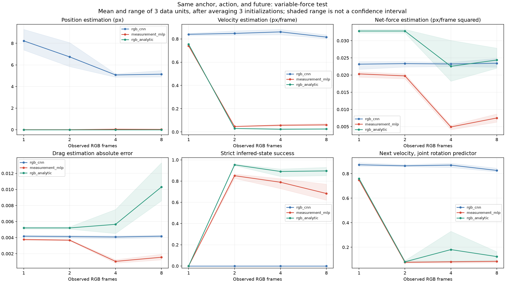
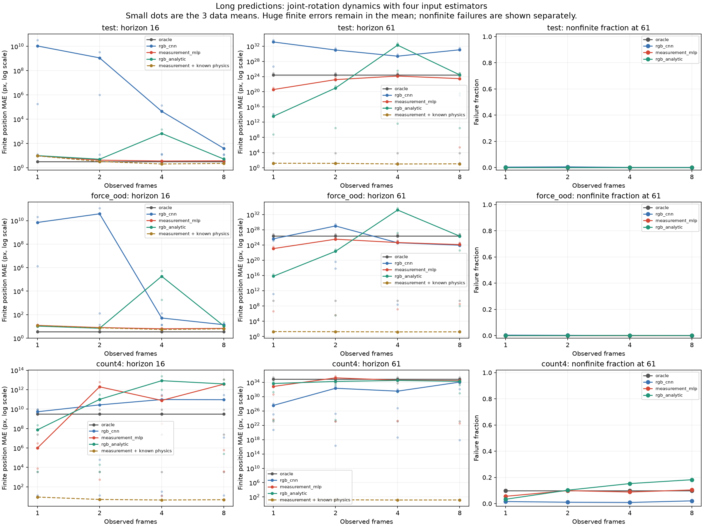
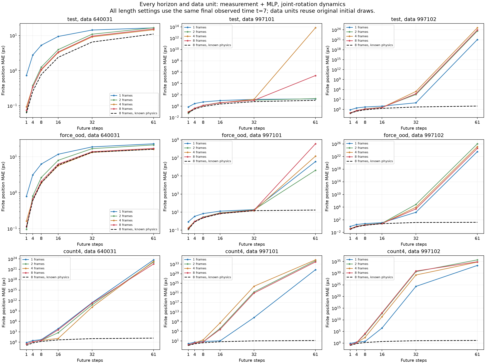
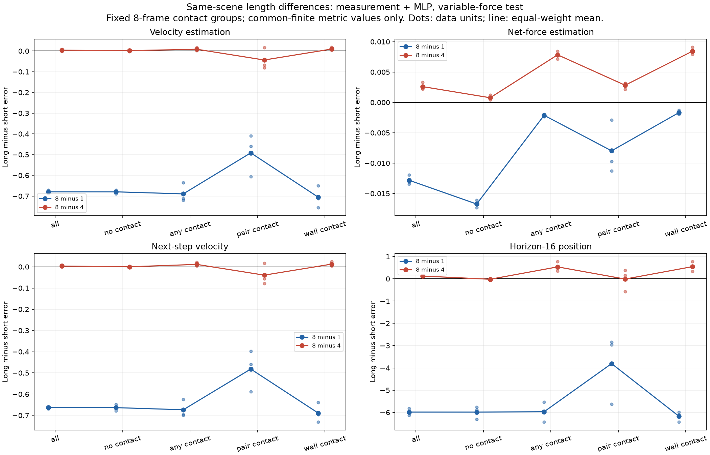
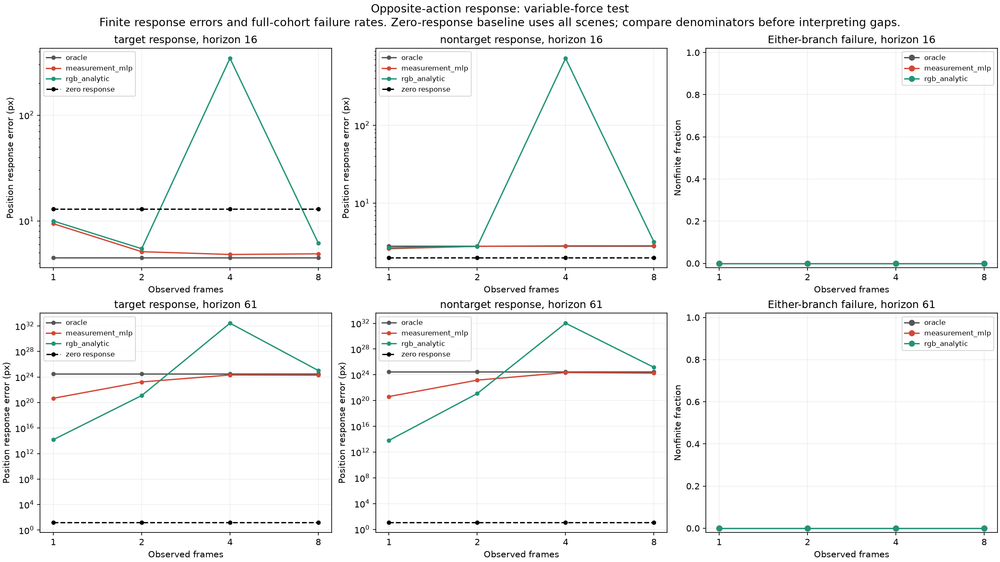

# How long should we look at the same past?

Observations 1, 2, 4, and 8 were compared at the same final time point t=7. We completed the 72 estimated models and the replication verification of all one-step, long-term, and opposite behavior evaluations and aggregations. The table below shows the results of averaging the initial three sets of data from the three data sets first, then applying the same weights to each data set. The initial nine sets of data are not counted as nine independent data sets.

The initial scenes of the three existing datasets were reused, and the action time was shifted to recalculate the future. No new independent dataset bundles were added, and no simple forward-and-backward performance comparison was performed with the existing t=3 results. All paths shared the same state, action, and future, and were checked to ensure that the obscured past video and measurement values did not influence the input.

RGB CNN directly reads the video. The measurement + MLP and video physics models utilize the known color, rendering, and motion rules of a circular object, so they are not pure video learning comparisons under the same prior knowledge conditions. The estimator's capacity, initial weights, and learning sample order were aligned by length, and the final 4,000-step checkpoint was fixed for evaluation.

## Status and environment estimation and one-step connection

The error is the missing estimate filled in as 0 based on the correct object position and velocity on the table. It is not the same as the error for the object discovered in reality. All success indicators for detection and strict scene verification have been preserved together with the original dataset. This is a general variable-force test, and the units are position pixels, velocity pixels/frame, and sum-of-squares pixels/frame².

| Input method | Video count | Location estimation | Speed estimation | Combined estimation | Next speed |
| --- | ---: | ---: | ---: | ---: | ---: |
| rgb_cnn | 1 | 8.2236 | 0.8396 | 0.0232 | 0.8725 |
| rgb_cnn | 2 | 6.7412 | 0.8471 | 0.0233 | 0.8640 |
| rgb_cnn | 4 | 5.0698 | 0.8602 | 0.0232 | 0.8697 |
| rgb_cnn | 8 | 5.1401 | 0.8155 | 0.0234 | 0.8264 |
| measurement_mlp | 1 | 0.0027 | 0.7405 | 0.0203 | 0.7478 |
| measurement_mlp | 2 | 0.0032 | 0.0471 | 0.0198 | 0.0768 |
| measurement_mlp | 4 | 0.0468 | 0.0574 | 0.0049 | 0.0809 |
| measurement_mlp | 8 | 0.0300 | 0.0611 | 0.0075 | 0.0843 |
| rgb_analytic | 1 | 0.0002 | 0.7534 | 0.0328 | 0.7601 |
| rgb_analytic | 2 | 0.0002 | 0.0301 | 0.0328 | 0.0810 |
| rgb_analytic | 4 | 0.0002 | 0.0235 | 0.0225 | 0.1807 |
| rgb_analytic | 8 | 0.0002 | 0.0254 | 0.0244 | 0.1235 |

## Results by data for the long future

This is the 61st-stage position error of the joint rotation predictor with measurement+MLP input. To avoid hiding even if one data point has a very large deviation, the average of the three data sets was displayed separately. It is a finite prediction error, and the relative failure rate is listed in a separate column. The success status, number of valid scenes, and all initialization values were preserved in the connected data.

| Conditions | Video count | Data 640031 | Data 997101 | Data 997102 | Hypothetical failure rate |
| --- | ---: | ---: | ---: | ---: | ---: |
| test | 1 | 16.5049 | 19.2988 | 1.173e+21 | 0.0000 |
| test | 2 | 16.6087 | 21.5933 | 4.751e+23 | 0.0000 |
| test | 4 | 14.5294 | 7.013e+13 | 4.171e+24 | 0.0000 |
| test | 8 | 15.3173 | 2.555e+05 | 8.651e+23 | 0.0000 |
| force_ood | 1 | 22.9323 | 3.954e+06 | 3.636e+23 | 0.0000 |
| force_ood | 2 | 21.3530 | 4.273e+05 | 1.059e+26 | 0.0000 |
| force_ood | 4 | 16.2941 | 1.566e+07 | 1.397e+25 | 0.0000 |
| force_ood | 8 | 17.1088 | 3.675e+08 | 4.058e+24 | 0.0000 |
| count4 | 1 | 5.413e+23 | 4.783e+30 | 2.182e+33 | 0.0556 |
| count4 | 2 | 1.325e+23 | 2.568e+34 | 5.281e+35 | 0.0990 |
| count4 | 4 | 2.025e+23 | 6.170e+34 | 5.747e+34 | 0.0885 |
| count4 | 8 | 3.528e+22 | 8.733e+33 | 7.886e+34 | 0.1042 |

## Difference in length of the same scene

Below are the average values of the scene-by-scene differences between L8-L1 and L8-L4, averaged across the data. Negative values indicate that the long observation error is smaller. Only scenes where both values are finite are considered for the difference calculation, and the denominator is the minimum/maximum number of scenes for each data set and initialization. We did not simply subtract the average valid scenes from each other.

| Comparison indicators | Length difference | Data 640031 | Data 997101 | Data 997102 | Range of common scenes |
| --- | --- | ---: | ---: | ---: | --- |
| Speed estimation | 8−1 | -0.6798 | -0.6706 | -0.6877 | 128–128 |
| Speed estimation | 8−4 | 0.0047 | 0.0080 | -0.0014 | 128–128 |
| Estimated combined years | 8−1 | -0.0131 | -0.0120 | -0.0134 | 128–128 |
| Estimated combined years | 8−4 | 0.0022 | 0.0033 | 0.0023 | 128–128 |
| Next speed | 8−1 | -0.6698 | -0.6599 | -0.6608 | 128–128 |
| Next speed | 8−4 | 0.0024 | 0.0084 | -0.0007 | 128–128 |
| 16th stage position | 8−1 | -5.9993 | -5.8223 | -6.1289 | 128–128 |
| 16th stage position | 8−4 | 0.1274 | 0.1501 | 0.0949 | 128–128 |
| 61st stage position | 8−1 | -1.1876 | 2.554e+05 | 8.639e+23 | 128–128 |
| 61st stage position | 8−4 | 0.7878 | -7.013e+13 | -3.305e+24 | 128–128 |

The scope of contact comparisons was fixed at the past 7 trials shown in L8. The correct contact information was used only for dividing the evaluation group and was not provided for the estimator input. Since the actual past contact scope shown at each length may vary, we do not call it the length effect by directly subtracting the individual average.

## Criteria for interpreting opposite behavior and long predictions

The difference between the future with opposite behavior from the same initial past was divided into the target and non-target. The response error only exists on the limited scene of both pathways. The no-response comparison uses the entire scene, so if the effective denominator is different, the average difference is not interpreted as the performance improvement amount directly. All indicators, effective denominators, and failure rates for both pathways were stored.

Oracle inputs the correct initial state and environment, but does not receive the correct state again afterward. If the prediction continues for too long, it may fail. The known force-wall reference uses simulator rules and external forces, but omits object collisions. The difference with this reference is not proof of a new general physics learning ability.

## Total output and verification range

All indicators, horizon, and contact groups for observation 52 blocks and autonomous prediction 468 blocks were preserved in NPZ/JSON format. They include individual values for each length, common scene differences between six length pairs, and mean, effective sample size, total denominator, and range for data and initialization. The accuracy status + accuracy environment comparison and oracle autonomous prediction were confirmed to be identical regardless of observation length. The connected data for tables and figures is `report_v1/curves.json`, and the entire block list is `report_v1/aggregate_index.csv`.

The current document is responsible for the complete display of results and numbers. The comprehensive conclusion of information deficiency, perception errors, and transfer learning failures is connected to independent repetition and environmental information omission results in the separate C07 comprehensive document.

[Experiment plan](../../planning_C07_OBSERVATION_LENGTH_EN.md) · [Aggregation rules](../../planning_C07_LENGTH_AGGREGATION_EN.md) · [Display rules](../../planning_C07_LENGTH_REPORT_EN.md) · [Observation aggregation verification](../../../../../followup/reports/dynamics_observation_length_v1/aggregates_v1/observation_verification.json) · [Autonomous prediction aggregation verification](../../../../../followup/reports/dynamics_observation_length_v1/aggregates_v1/autonomous_verification.json)
