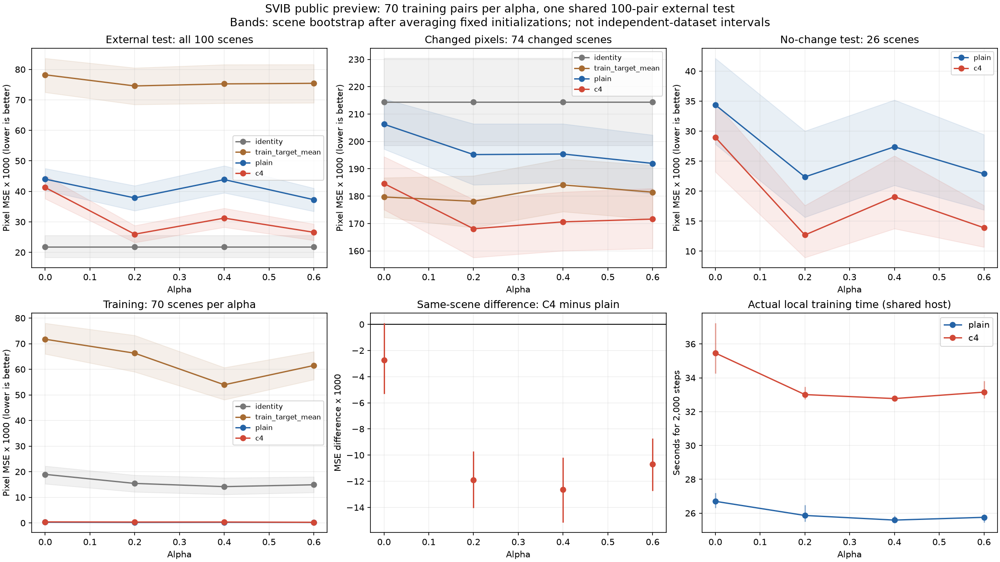
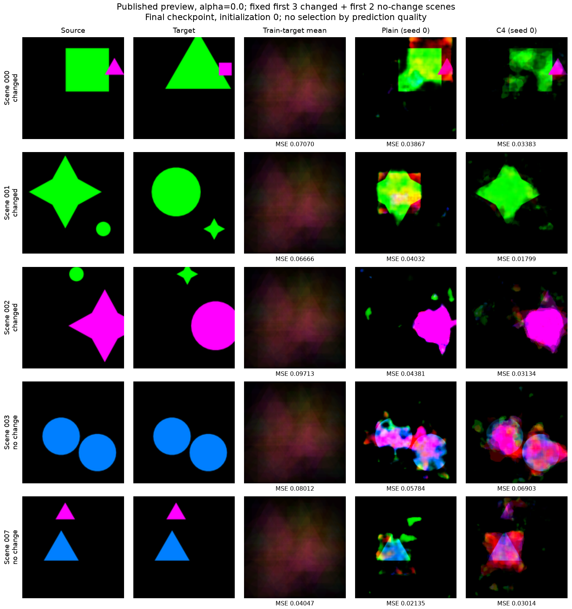
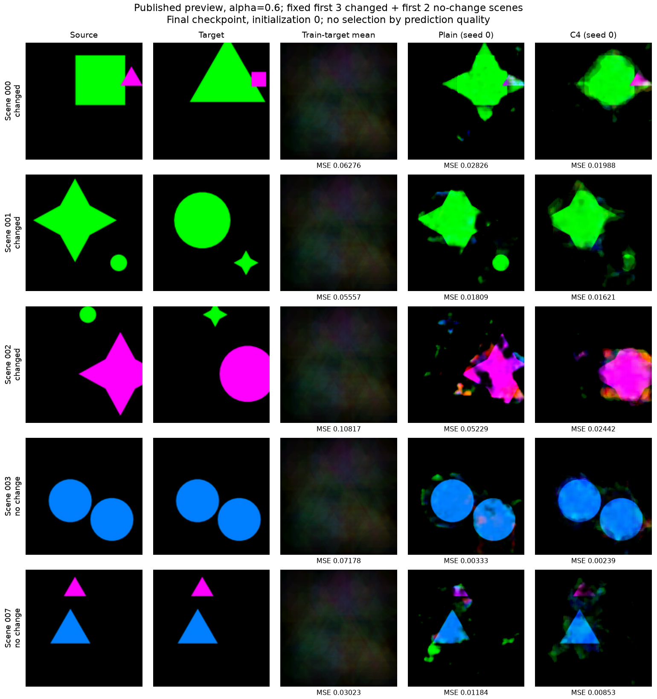

# External task connection in SVIB public example

We trained a small RGB predictor from scratch using 500 publicly available Shape-Swap examples from official dSprites / Single Atomic. We completed validation of all evaluation predictions and scores for 24 models. This experiment is an external task exploration, and the results do not replicate the overall SVIB benchmark performance.

Input is a single image from the previous image, and output is the image after transformation. The correct object properties, masks, and transformation rules were not entered. A C4 model was compared with a predictor applied to four rotation directions, similar to a general model. The transfer performance of the existing OrbitLab checkpoint was not measured.

## Comparison conditions with materials

The 100 pairs per alpha were trained using official sorting and split methods, divided into 70 (training) pairs, 15 (validation) pairs, and 15 (ID evaluation) pairs. All models share a separate Test 100 pair. The correct approach is to keep the 74 pairs where the pixels actually change and leave the 26 pairs unchanged. Different alphas and initializations are not counted separately in the independent data repetition.

The same parameters were used for 1,266,467 iterations, with the same initial weights and mini-batch order, and were fixed by 2,000 updates. All checkpoints of the 2 × alpha 4 × initialization 3 method were evaluated, and no selection based on scores was made. C4 averages the four baseline predictions, so it is not a comparison of identical computational loads.

## External 100 pairs of pixel error

The unit of the table is pixel MSE × 1,000, and the lower it is, the better. General/C4 uses three fixed initializations as the mean. The meaning of the success rate in shape exchange is not meaningful, and one cannot claim that the object structure has been understood only with a low pixel error.

| alpha | Keep it as is | Average learning answer | General | C4 |
| --- | ---: | ---: | ---: | ---: |
| 0.0 | 21.835 | 78.232 | 44.022 | 41.275 |
| 0.2 | 21.835 | 74.577 | 37.857 | 25.962 |
| 0.4 | 21.835 | 75.251 | 43.867 | 31.236 |
| 0.6 | 21.835 | 75.440 | 37.277 | 26.583 |

The overall pixel error of C4 was lower than that of the general model, with an alpha average of 4/4 pixels, and a paired comparison of the same initialization of 11/12 pixels. The alpha average that was lower than the comparison of keeping it as is was 0/4 pixels for the general model and 0/4 pixels for C4. This number is a technical statistic that reuses the same small external evaluation set.

## Actual areas to change and scenes to preserve

| alpha | Changed pixel error: Normal | Changed pixel error: C4 | Unchanged scene error: Normal | Unchanged scene error: C4 |
| --- | ---: | ---: | ---: | ---: |
| 0.0 | 206.288 | 184.611 | 34.381 | 28.977 |
| 0.2 | 195.195 | 168.091 | 22.377 | 12.699 |
| 0.4 | 195.403 | 170.614 | 27.392 | 19.075 |
| 0.6 | 191.976 | 171.623 | 22.897 | 13.903 |

The change region is a location where the pixels of the source and target differ and is used only for scoring. The 26 pairs of change region points that did not change are left as missing. The contrast error of keeping unchanged in a scene with no change is 0. The amount of the original parts that should be maintained has also been separately stored as the unchanged-pixel indicator for each scene.

## Learning cost and rotation consistency

| alpha | General learning beginner | C4 learning beginner | General 100-page CPU inference beginner | C4 100-page CPU inference beginner |
| --- | ---: | ---: | ---: | ---: |
| 0.0 | 26.700 | 35.465 | 0.182 | 0.766 |
| 0.2 | 25.864 | 33.009 | 0.174 | 0.704 |
| 0.4 | 25.590 | 32.772 | 0.173 | 0.707 |
| 0.6 | 25.753 | 33.154 | 0.178 | 0.711 |

The maximum pixel consistency error for all external inputs in the C4 model across three rotations was 1.192e-07. This is a consistency check for output rotations and not a guarantee of the target image accuracy. Training was performed on local MPS, and checkpoint storage was recorded on the CPU. Since the results were shared with other research work and computers, the time in the table represents the measurement of this run and is not a general speed ranking.

## Difference from the official protocol

| Item | Official material·code | This execution |
| --- | --- | --- |
| Scope | 12 tasks of multiple domains and rules | dSprites / Single Atomic public preview one task |
| Material size | 64,000 learning pool·8,000 tests per assignment | 100 pairs of pool·common tests per alpha |
| Split | After sorting 70%/15%/15% | Pairs of 70/15/15 with the same rule |
| Evaluation sample | Code basic batch/drop_last/max_images setting | All 100 pairs up to the last bundle |
| MSE | Divide pixel/channel error sum into image count | Save both element-wise MSE and image-wise sum; 49,152 times correlation verification |
| LPIPS | Included in official evaluation indicators | Unmeasured |
| Model | Models compared in the paper and learning settings | Small residual CNN general/C4, fixed 2,000 updates |

We confirmed the separation between the learning source combinations and test source combinations, but some combinations of the learning target overlap with the test source. We recorded the exposure of source and target separately, and we do not interpret this fact as pixel duplication or a leakage of the entire official benchmark. We preserved the original stored RGB channels and pixels.

## Verification and interpretation scope

We reproduced the 4,800 predictions and 7,200 rotation input predictions of 24 models. We examined all pixel/region scores, 1,536 counts, and 1,920 pair differences, as well as the learning initial values, sample order, and final optimizer state. This is not a re-run of the entire MPS training set. The intervals are conditional bootstrap conditions after re-sampling unique scenes from the initialization mean, and they do not represent uncertainty about new datasets.

In the first baseline verification, we found approximately 10⁻¹⁷ residual values in the average computation order, and v2, which was tested within the existing allowable range, passed. In the separate rotation formula verification, we separated the float32 batch computation differences of approximately 5.6×10⁻⁶ into float64 formula verification. The allowable criteria for stored prediction/indicators and actual output playback/rotation verification were not changed, and we preserved the failure codes and logs.

Overfitting is possible in the small learning materials of the public examples. Only with this result can one claim superiority over the latest methods in natural language editing, stable object manipulation, external transfer of existing checkpoints, or otherwise. Executing the entire official data and the comparison model of the original author using the same protocol was not included in this reduced experiment.

[Official project](https://systematic-visual-imagination.github.io/) · [Execution plan](../../planning_B06_SVIB_PREVIEW_EN.md) · [Data verification](../../../../../followup/reports/svib_preview_shape_swap_v1/data_verification.json) · [Model verification](../../../../../followup/reports/svib_preview_shape_swap_v1/model_verification.json) · [Overall aggregation](../../../../../followup/reports/svib_preview_shape_swap_v1/aggregate_v1/summary.json) · [Aggregation verification](../../../../../followup/reports/svib_preview_shape_swap_v1/aggregate_v1/verification.json)
